# Návod k Workout deníku

Workout deník je appka na zapisování tréninků ve fitku. Běží v Chromu na Androidu,
nainstaluje se na plochu jako normální aplikace a funguje i bez internetu.
Všechna data zůstávají jen v telefonu.

Obrázky v návodu jsou z appky s vymyšlenými ukázkovými daty (dvě fitka „Fitko Centrum"
a „Fitko Sever", šablony Push / Pull / Nohy). Očíslované tyrkysové rámečky odpovídají
číslům v textu pod obrázkem.

Co se v appce změnilo a kdy: [Co je nového](../release-notes.md).

## Obsah

1. [Instalace do telefonu](#1-instalace-do-telefonu)
2. [První spuštění: fitka a nastavení](#2-první-spuštění-fitka-a-nastavení)
3. [Úvodní obrazovka Trénink](#3-úvodní-obrazovka-trénink)
4. [Trénink krok za krokem](#4-trénink-krok-za-krokem)
5. [Šablony](#5-šablony)
6. [Historie](#6-historie)
7. [Cviky](#7-cviky)
8. [Statistiky](#8-statistiky)
9. [Tělo (měření)](#9-tělo-měření)
10. [Záloha a obnova dat](#10-záloha-a-obnova-dat)
11. [Tipy a časté otázky](#11-tipy-a-časté-otázky)

---

## 1. Instalace do telefonu

1. V telefonu otevři v **Chromu** adresu appky: <https://dt-appdev.github.io/workout-denik/>
2. Klepni vpravo nahoře na **⋮** (tři tečky).
3. Zvol **Přidat na plochu** → **Nainstalovat** (v některých verzích Chromu rovnou
   **Nainstalovat aplikaci**).
4. Na ploše přibude ikona **Workout deník**. Appku odteď spouštěj přes ni.
   Otevře se na celou obrazovku, bez adresního řádku.

Dobré vědět:

- **Funguje offline.** Po prvním otevření si appka uloží všechny své soubory
  do telefonu, internet potřebuje jen na aktualizace a na odkazy ven (video, návod).
- **Aktualizuje se sama.** Když vyjde nová verze, appka si ji při otevření stáhne
  a jednou se sama znovu načte. Rozdělaný trénink se tím neztratí.
- **Data jsou jen v telefonu.** Nikam se neposílají. Proto si dělej
  [zálohu](#10-záloha-a-obnova-dat) – appka ti to sama připomene.
- Vpravo nahoře je vidět stav ukládání: **Uloženo** (vše je bezpečně v telefonu),
  **Ukládám…** (zápis právě probíhá) nebo **Jen v zařízení** (úložiště prohlížeče
  teď není dostupné, záznamy se uloží, až bude).

Spodní lišta má šest záložek: **Trénink, Historie, Cviky, Statistiky, Tělo, Nastavení**.

---

## 2. První spuštění: fitka a nastavení

Appka počítá s tím, že cvičíš ve víc fitkách a stejný stroj má v každém jiný odpor.
Proto si nejdřív založ fitka, ve kterých cvičíš.

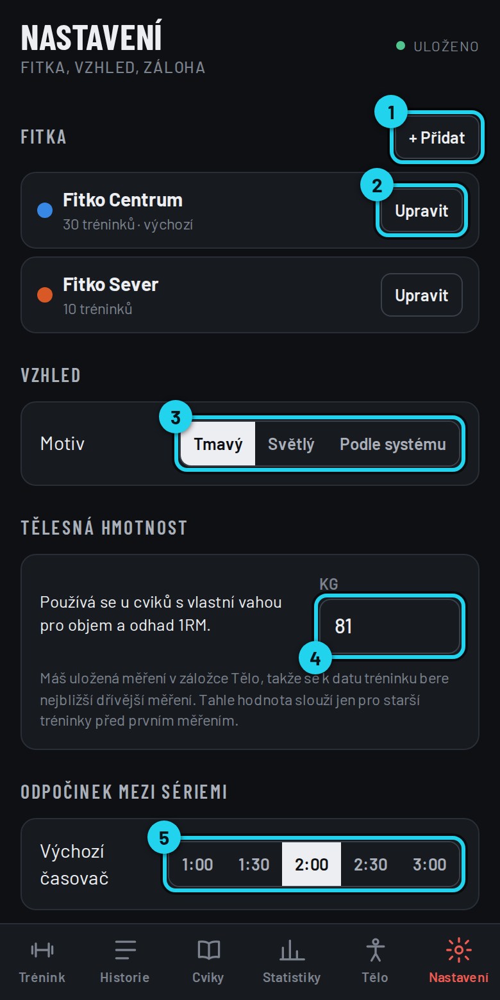

Záložka **Nastavení**:

1. **+ Přidat** – založí nové fitko.
2. **Upravit** – přejmenování fitka, nastavení výchozího fitka. Fitko jde smazat,
   jen když v něm nemáš žádný trénink (tréninky se dají přesunout jinam v Historii).
3. **Motiv** – tmavý, světlý, nebo podle nastavení telefonu.
4. **Tělesná hmotnost** – používá se u cviků s vlastní vahou (shyby, kliky) pro objem
   a odhad 1RM, dokud nemáš měření v záložce [Tělo](#9-tělo-měření).
5. **Výchozí časovač** – jak dlouhý je odpočinek mezi sériemi (1:00 až 3:00).

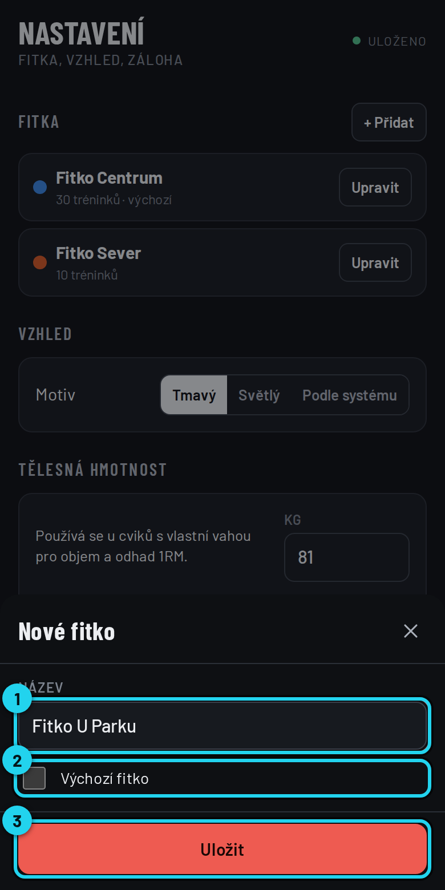

Založení fitka:

1. Napiš název.
2. Zapni **Výchozí fitko**, pokud v něm cvičíš nejčastěji – appka ho pak předvybere.
3. **Uložit**.

> **Přecházíš z jiného telefonu nebo z původní verze appky?** Nejdřív obnov data
> ze zálohy: [Nastavení → Záloha → Obnovit ze souboru](#obnova-ze-zálohy).

---

## 3. Úvodní obrazovka Trénink

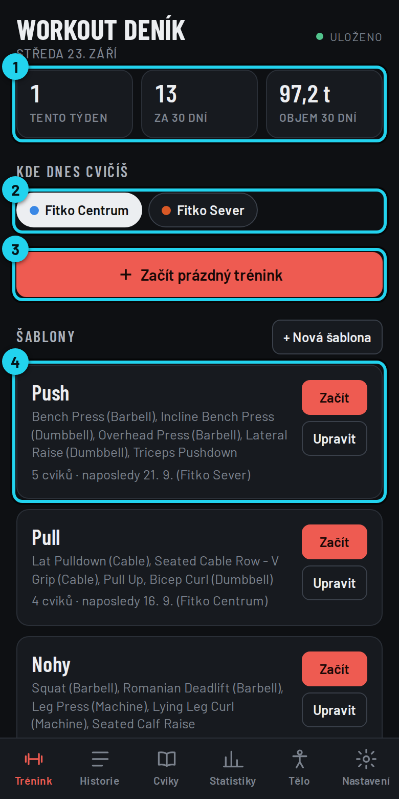

1. **Přehled** – počet tréninků tento týden a za posledních 30 dní, celkový objem
   (součet váha × opakování) za 30 dní.
2. **Kde dnes cvičíš** – klepni na fitko, ve kterém jsi. Podle něj appka nabízí
   hodnoty z minula a počítá rekordy.
3. **Začít prázdný trénink** – trénink bez šablony, cviky si přidáš postupně.
4. **Šablony** – připravené tréninky. **Začít** spustí trénink se všemi cviky
   a vahami ze šablony, **Upravit** otevře úpravu šablony. U šablony vidíš,
   kdy a kde jsi ji cvičil naposledy.

Když máš rozdělaný trénink a přepneš na jinou záložku, u ikony **Trénink** svítí tečka.

---

## 4. Trénink krok za krokem

### Krok 1: Spusť trénink

Na úvodní obrazovce vyber fitko a klepni na **Začít** u šablony (nebo na
**Začít prázdný trénink**).

### Krok 2: Zapisuj série

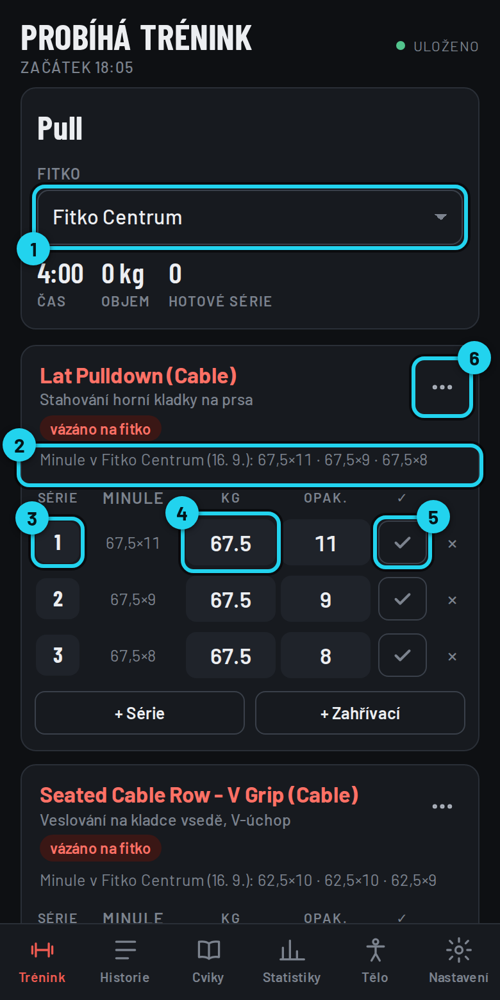

1. **Fitko** – pokud jsi na začátku zapomněl vybrat fitko, změň ho tady.
   Nahoře pod ním běží čas tréninku, objem a počet hotových sérií.
2. **Minule** – co jsi u cviku dělal minule. U cviků „vázaných na fitko"
   (stroje, kladky) se ukazuje minulý trénink **v tomtéž fitku**.
3. **Typ série** – klepnutím se přepíná:

   | Značka | Typ | Počítá se do objemu a rekordů? |
   |---|---|---|
   | 1, 2, 3… | pracovní série | ano |
   | **W** | zahřívací | ne |
   | **D** | drop set | ano |
   | **F** | do selhání | ano |
4. **kg a Opak.** – váha a počet opakování. Ze šablony nebo z minula jsou už
   předvyplněné, stačí opravit, co se změnilo.
5. **✓ Hotovo** – odškrtni sérii, jakmile ji docvičíš. Když necháš políčka prázdná,
   ✓ doplní hodnoty z minula.
6. **⋯ Možnosti cviku** – poznámka, nahrazení jiným cvikem, posunutí výš/níž,
   stránka cviku, odebrání.

Pod každým cvikem jsou tlačítka **+ Série** (zkopíruje poslední pracovní sérii)
a **+ Zahřívací** (přidá zahřívací sérii na začátek). Křížek **×** vpravo sérii smaže.

### Krok 3: Odpočinek a rekordy

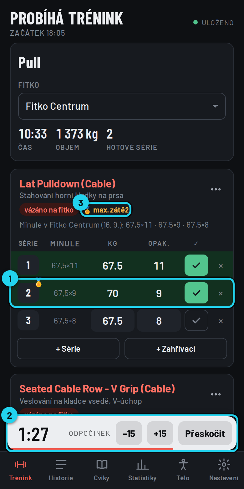

1. Hotová série se podbarví zeleně.
2. **Časovač odpočinku** se spustí sám po každém ✓. Tlačítky **−15 / +15** ubereš
   nebo přidáš 15 sekund, **Přeskočit** ho zavře. Na konci zapípá a zavibruje.
3. **🏅 Rekord** – když překonáš svůj rekord (třeba max. zátěž), appka to hned
   ukáže u cviku i u série.

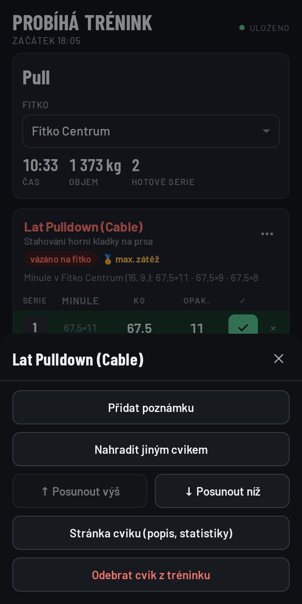

Nabídka **⋯** u cviku: přidat poznámku (např. nastavení sedačky), nahradit cvik
jiným (třeba když je stroj obsazený), změnit pořadí, otevřít stránku cviku nebo cvik
z tréninku odebrat.

### Krok 4: Přidej cvik

Pod posledním cvikem klepni na **+ Přidat cvik**.

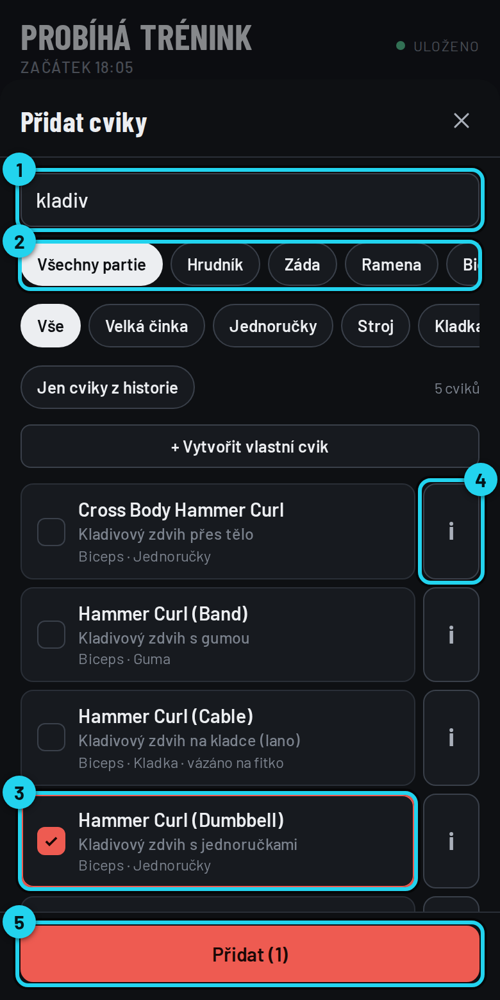 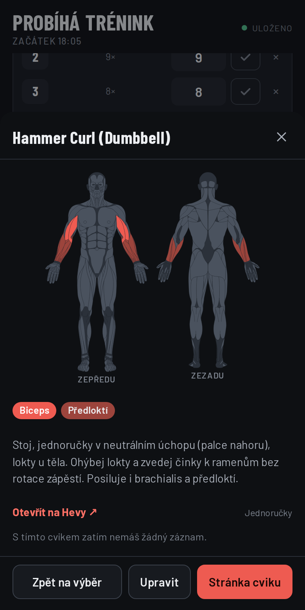

1. **Hledání** – funguje česky i anglicky a nezáleží na diakritice
   („kladiv" najde „Kladivový zdvih").
2. **Filtry** – partie (Hrudník, Záda…) a pod nimi vybavení (Velká činka, Stroj…).
   Tlačítko **Jen cviky z historie** ukáže jen to, co už jsi někdy cvičil.
3. Klepnutím cvik **označíš** – najednou jich jde označit víc.
4. **i** – ukáže svalovou mapu, popis provedení a tvoje poslední výsledky (obrázek vpravo).
   **Zpět na výběr** tě vrátí k seznamu, označené cviky zůstanou.
5. **Přidat** – přidá označené cviky do tréninku.

Cvik, který v databázi není, vytvoříš tlačítkem **+ Vytvořit vlastní cvik**
(viz [Úprava a vlastní cviky](#úprava-a-vlastní-cviky)).

### Krok 5: Dokonči trénink

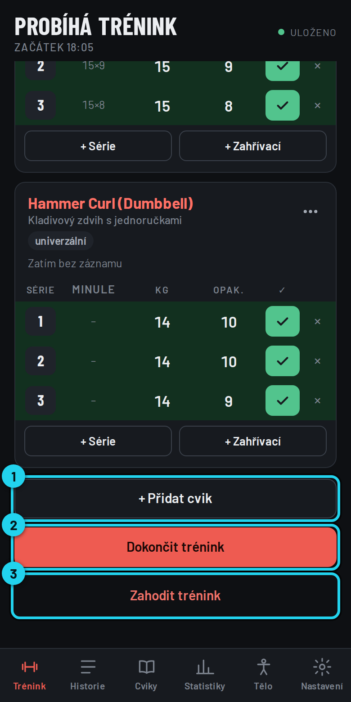 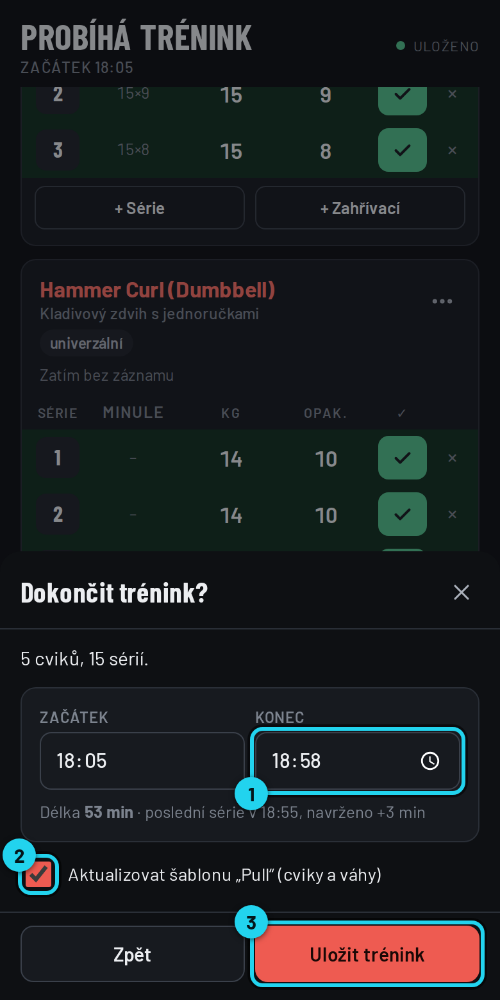

Na konci stránky (obrázek vlevo):

1. **+ Přidat cvik**
2. **Dokončit trénink**
3. **Zahodit trénink** – rozdělaný trénink se smaže a neuloží (appka se ještě zeptá).

Po klepnutí na **Dokončit trénink** (obrázek vpravo):

1. **Konec** – appka navrhne čas 3 minuty po poslední sérii. Když jsi zapomněl trénink
   ukončit hned, uloží se tak správná délka. Čas jde přepsat.
2. **Aktualizovat šablonu** – když cvičíš podle šablony, uloží do ní dnešní cviky
   a váhy, takže příště začneš od nich. Když to nechceš, odškrtni.
3. **Uložit trénink**.

Uloží se jen série označené ✓. Kolik neoznačených sérií se neuloží, appka napíše.

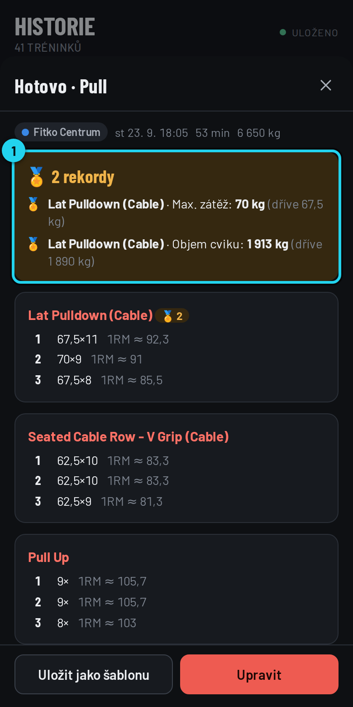

Po uložení se ukáže souhrn tréninku. (1) V rámečku jsou nové **osobní rekordy**
a o kolik jsi překonal ty předchozí.

> **Rozdělaný trénink se neztratí.** Appku můžeš během tréninku zavřít, přepnout
> jinam nebo zamknout telefon. Po návratu trénink pokračuje tam, kde jsi skončil.

---

## 5. Šablony

Šablona je uložený seznam cviků i se sériemi a vahami. Založit ji jde třemi způsoby:

- **Trénink → + Nová šablona** – prázdná šablona, cviky přidáš přes **+ Přidat cvik**.
- **Historie → trénink → Uložit jako šablonu** – z odcvičeného tréninku.
- Při dokončení tréninku podle šablony se šablona sama aktualizuje
  (volba **Aktualizovat šablonu**).

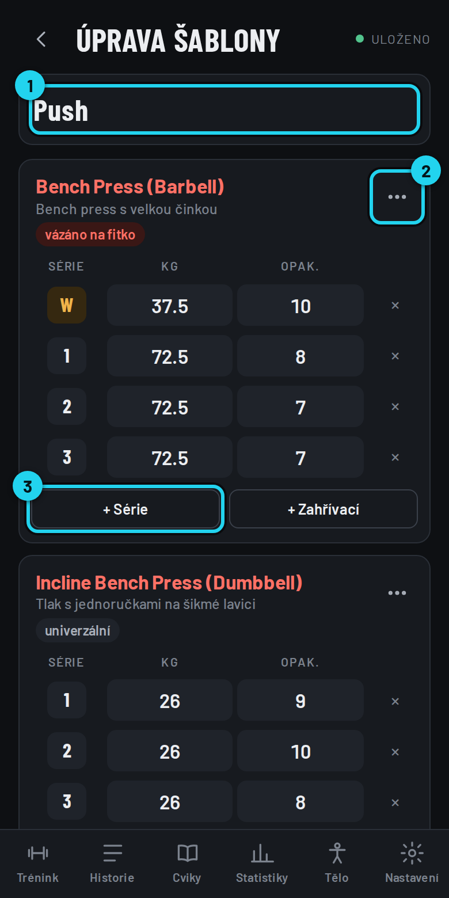

Úprava šablony (**Trénink → Upravit** u šablony):

1. **Název** šablony.
2. **⋯** u cviku – pořadí, nahrazení, odebrání.
3. **+ Série / + Zahřívací** – přidání sérií. Váhy a opakování jdou přepsat přímo.

Nakonec **Uložit šablonu** (dole). Šablonu smažeš tlačítkem **Smazat šablonu**,
tréninky podle ní zůstanou.

---

## 6. Historie

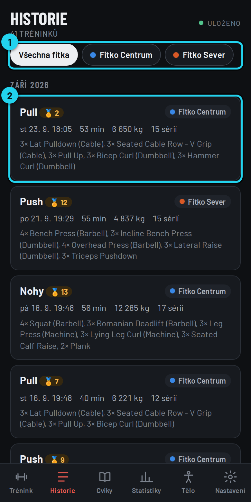 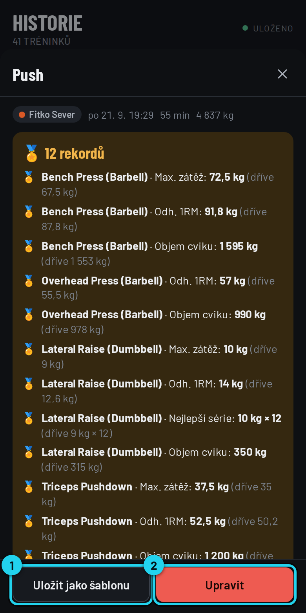

1. **Filtr fitka** – všechna fitka, nebo jen jedno.
2. **Trénink** – datum a čas, délka, objem, počet sérií a 🏅 počet rekordů.
   Klepnutím se otevře detail (obrázek vpravo).

V detailu tréninku jsou všechny série i s odhadem 1RM a dole tlačítka:

1. **Uložit jako šablonu**
2. **Upravit**

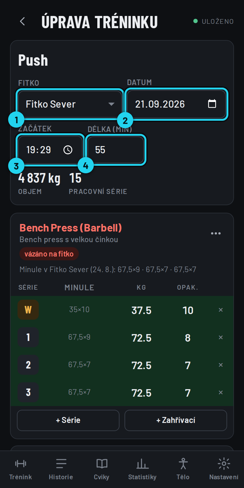

Úprava odcvičeného tréninku – hodí se, když jsi zapomněl něco zapsat nebo
trénink ukončit:

1. **Fitko** – přesun tréninku do jiného fitka.
2. **Datum**
3. **Začátek**
4. **Délka** v minutách. Ručně změněná délka je v historii označená „✎ upraveno".

Série se upravují stejně jako při tréninku. Nakonec **Uložit změny**, nebo
**Smazat trénink**.

---

## 7. Cviky

### Seznam cviků

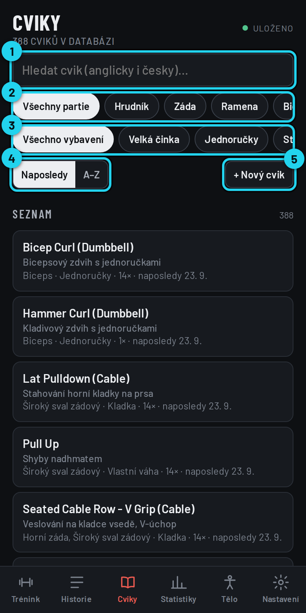

Záložka **Cviky** obsahuje celou databázi (přes 380 cviků s českými názvy, partiemi
a popisem) i tvoje vlastní cviky.

1. **Hledání** česky i anglicky, bez ohledu na diakritiku.
2. **Filtr partie**.
3. **Filtr vybavení**. Oba filtry si appka pamatuje.
4. **Řazení** – *Naposledy* (nahoře to, co jsi cvičil nedávno) nebo *A–Z*.
5. **+ Nový cvik** – vlastní cvik.

Pokud máš nějaké cviky skryté, objeví se vedle řazení tlačítko **Skryté (počet)**.

### Stránka cviku: Popis

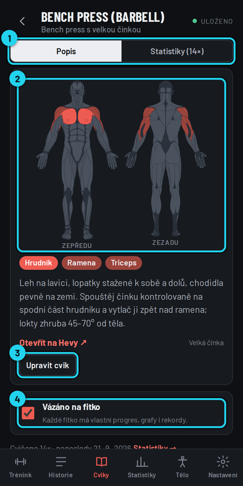

1. Přepínač **Popis / Statistiky**.
2. **Svalová mapa** – sytě jsou hlavní partie, tlumeně pomocné. Pod ní štítky partií,
   popis provedení a odkaz na Hevy nebo na video.
3. **Upravit cvik**.
4. **Vázáno na fitko** – viz rámeček níže.

> **Co znamená „Vázáno na fitko"?** U strojů a kladek má každé fitko jiný odpor,
> takže 50 kg v jednom fitku není 50 kg v druhém. Když je cvik vázaný na fitko,
> appka mu počítá hodnoty z minula, grafy a rekordy **zvlášť pro každé fitko**.
> U volných vah (velká činka, jednoručky) to vypni a data ze všech fitek se sečtou.

### Stránka cviku: Statistiky

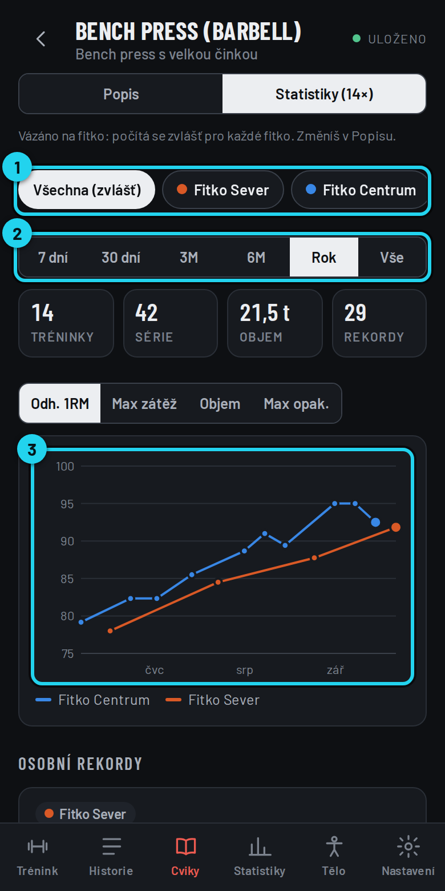 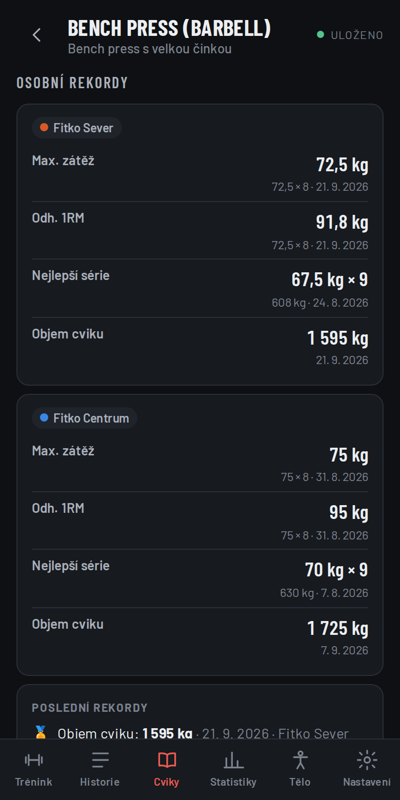

1. **Fitka** – u cviku vázaného na fitko: všechna (každé svou čarou), nebo jen jedno.
2. **Období** – 7 dní až vše. Pod ním souhrn: tréninky, série, objem, rekordy.
3. **Graf** – vyber, co ukazuje: odhad 1RM, max. zátěž, objem, nebo max. opakování.

Níž (obrázek vpravo) jsou **osobní rekordy** (pro každé fitko zvlášť, pokud je cvik
vázaný na fitko), **poslední rekordy** a **historie cviku** po trénincích.

Odhad 1RM (maximum na jedno opakování) se počítá podle Epleyho:
váha × (1 + opakování / 30). Zahřívací série se nepočítají. První trénink s cvikem
rekord nezakládá – je to výchozí bod.

### Úprava a vlastní cviky

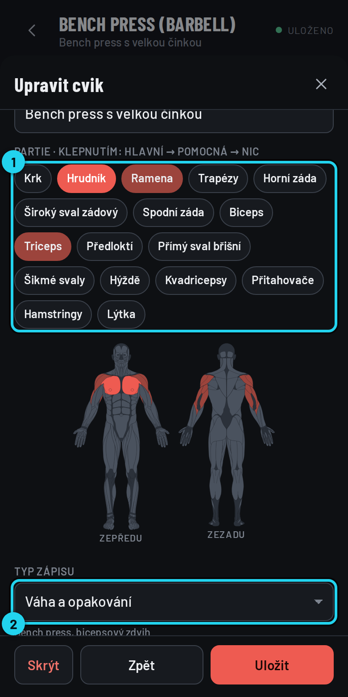

**Upravit cvik** (nebo **+ Nový cvik**) otevře formulář: anglický a český název,
partie, typ zápisu, vybavení, vázání na fitko, popis a odkaz.

1. **Partie** – klepnutím se přepíná: **hlavní** (sytá) → **pomocná** (tlumená) → nic.
   Svalová mapa pod tím se hned překreslí.
2. **Typ zápisu** – co se u série zapisuje:

   | Typ | Příklad |
   |---|---|
   | Váha a opakování | bench press, bicepsový zdvih |
   | Vlastní váha | shyby, kliky |
   | Vlastní váha se zátěží | shyby se zátěží |
   | S dopomocí | shyby s dopomocí stroje |
   | Na čas | plank, vis |
   | Na čas se zátěží | farmářská chůze |
   | Vzdálenost a čas | běh, veslovací trenažér |

Tlačítka dole:

- **Skrýt** – cvik se přestane nabízet při přidávání do tréninku. Historie ani
  statistiky se nesmažou. Vrátíš ho přes **Cviky → Skryté → cvik → Upravit cvik → Zobrazit**.
- **Výchozí** – vrátí cvik z databáze do původní podoby (objeví se, jen když jsi ho změnil).
- **Uložit**.

---

## 8. Statistiky

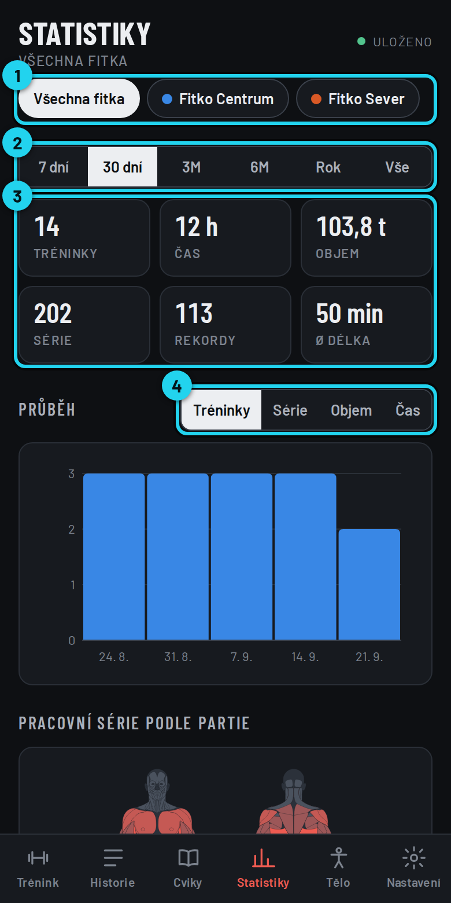 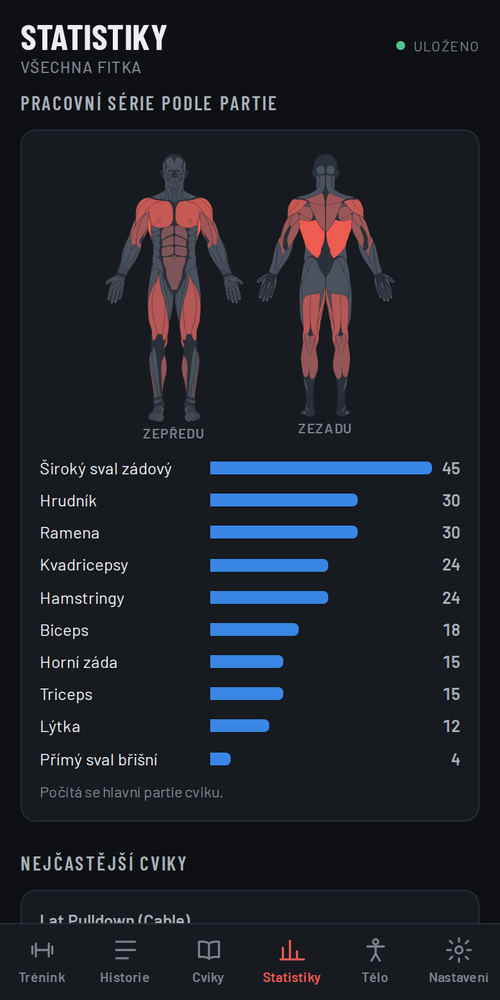

1. **Fitko** – všechna, nebo jedno.
2. **Období** – 7 dní, 30 dní, 3 měsíce, 6 měsíců, rok, vše.
3. **Souhrn za období** – tréninky, čas, objem, série, rekordy, průměrná délka.
4. **Graf průběhu** – přepni, co ukazuje: tréninky, série, objem, nebo čas.

Níže (obrázek vpravo):

- **Pracovní série podle partie** – čím sytější barva na postavě, tím víc sérií
  na tu partii. Počítá se hlavní partie cviku.
- **Nejčastější cviky** a rozdělení **podle fitek**.
- **Souhrn** za minulý měsíc, pololetí nebo minulý rok.
- **Cviky** – seznam všech cvičených cviků s hledáním a filtrem partie.
  Klepnutím se otevřou statistiky cviku.

---

## 9. Tělo (měření)

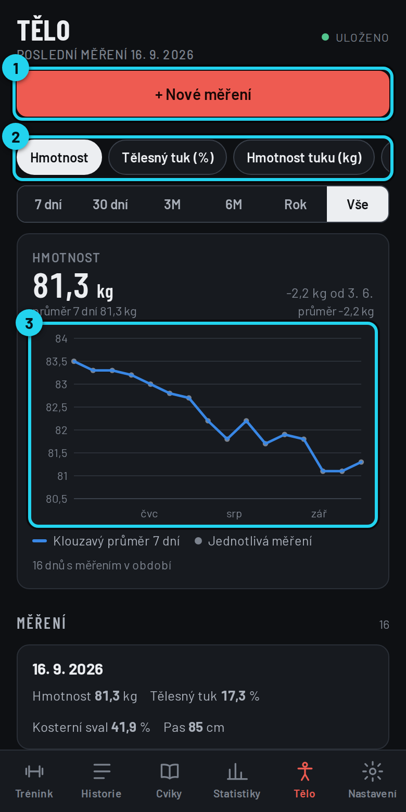 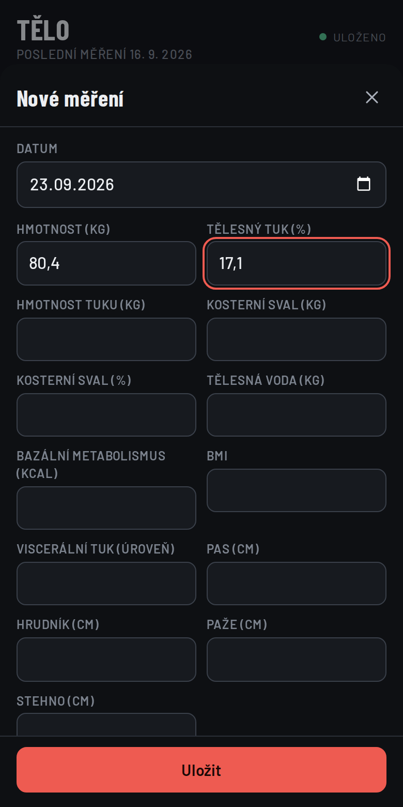

1. **+ Nové měření** – formulář vpravo. Vyplň jen to, co znáš (třeba jen hmotnost),
   ostatní nech prázdné. Desetinná čísla jdou psát s čárkou.
2. **Co zobrazit** – hmotnost, tělesný tuk, kosterní sval, voda, BMI, obvody…
3. **Graf** – modrá čára je klouzavý průměr za 7 dní (vyhladí denní výkyvy),
   tečky jsou jednotlivá měření. Nad grafem je změna za zvolené období.

Pod grafem je seznam měření. Klepnutím na měření ho upravíš nebo smažeš.

Hmotnost z měření appka používá u cviků s vlastní vahou: k datu tréninku vezme
nejbližší dřívější měření.

---

## 10. Záloha a obnova dat

Data jsou jen v telefonu. Když telefon ztratíš nebo smažeš data Chromu, bez zálohy
jsou pryč. Záloha je jeden soubor (JSON) se vším: tréninky, šablony, cviky, fitka
a měření.

### Připomínka

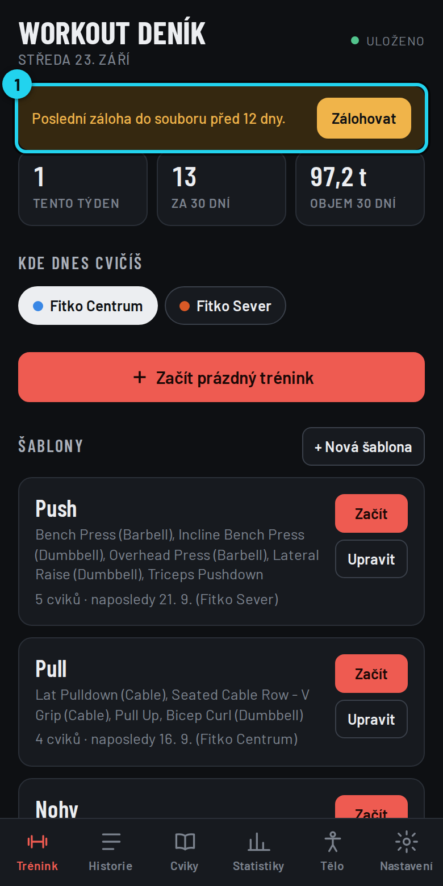 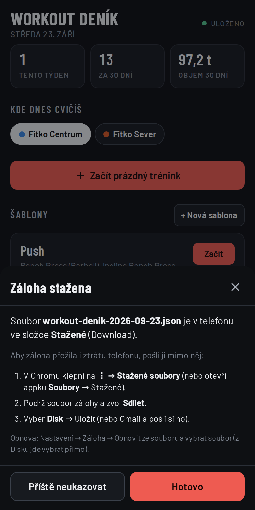

(1) Když jsi 7 dní nezálohoval, ukáže se na úvodní obrazovce žlutý pruh.
Klepni na **Zálohovat**.

### Záloha na Google Disk

1. Klepni na **Zálohovat** (nebo **Nastavení → Záloha → Stáhnout zálohu**).
2. Soubor `workout-denik-RRRR-MM-DD.json` se uloží do složky **Stažené**.
   Appka ukáže návod (obrázek vpravo nahoře).
3. V Chromu klepni na **⋮ → Stažené soubory** (nebo otevři appku **Soubory → Stažené**).
4. Podrž soubor zálohy a zvol **Sdílet**.
5. Vyber **Disk → Uložit** (nebo **Gmail** a pošli si ho e-mailem).

### Nastavení → Záloha

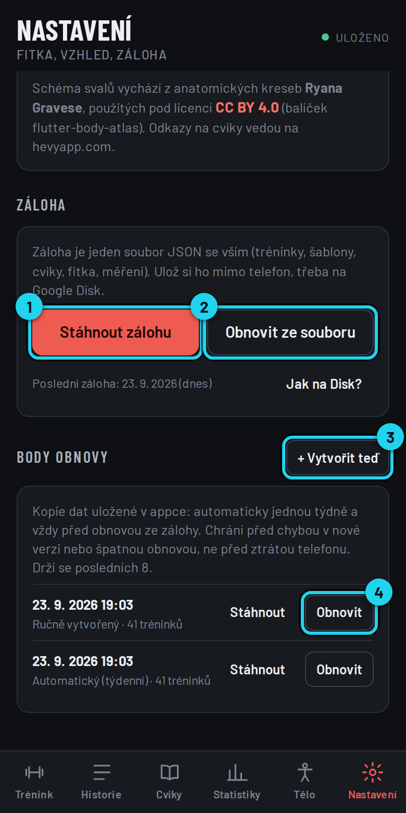

1. **Stáhnout zálohu** – viz výše. Pod tlačítky je datum poslední zálohy
   a odkaz **Jak na Disk?** s postupem.
2. **Obnovit ze souboru** – načte zálohu (i přímo z Disku).
3. **+ Vytvořit teď** – ruční bod obnovy.
4. **Obnovit** u bodu obnovy – vrátí data do stavu v daném okamžiku.

**Body obnovy** jsou kopie dat uložené přímo v appce. Vznikají automaticky jednou
týdně a vždy před obnovou ze zálohy, drží se posledních 8. Chrání před chybou v nové
verzi nebo špatnou obnovou, **ne před ztrátou telefonu** – na to je záloha na Disku.
Tlačítkem **Stáhnout** si bod obnovy uložíš jako soubor.

### Obnova ze zálohy

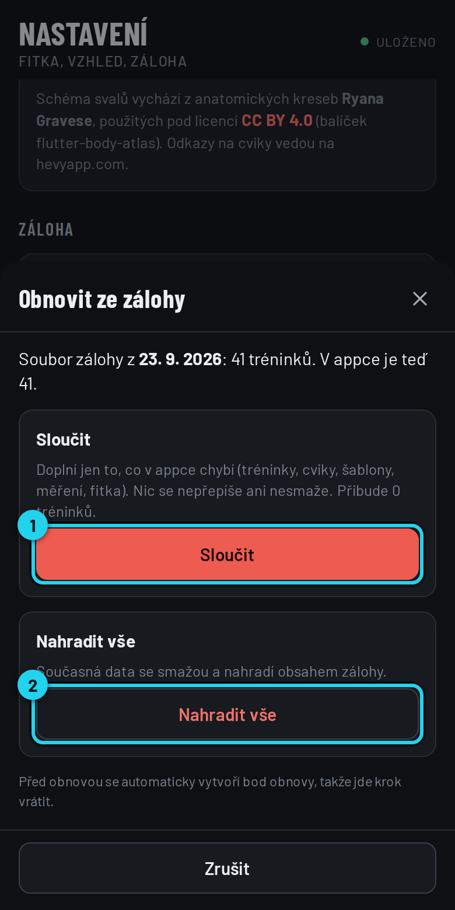

Po výběru souboru (nebo bodu obnovy) appka ukáže, kolik tréninků záloha obsahuje,
a nabídne dvě možnosti:

1. **Sloučit** – doplní jen to, co v appce chybí. Nic se nepřepíše ani nesmaže.
   Bezpečná volba, třeba když chceš přidat starší tréninky.
2. **Nahradit vše** – současná data se smažou a nahradí obsahem zálohy
   (appka se ještě jednou zeptá). Použij při přechodu na nový telefon.

Před obnovou appka vždy sama vytvoří bod obnovy, takže krok jde vrátit.

---

## 11. Tipy a časté otázky

**Kde zjistím, co je v appce nového?**
V [Co je nového](../release-notes.md). Odkaz je i v appce: **Nastavení → O aplikaci**
(nad sekcí Záloha), vedle tlačítka na tento návod. Otevřou se v Chromu a potřebují internet.

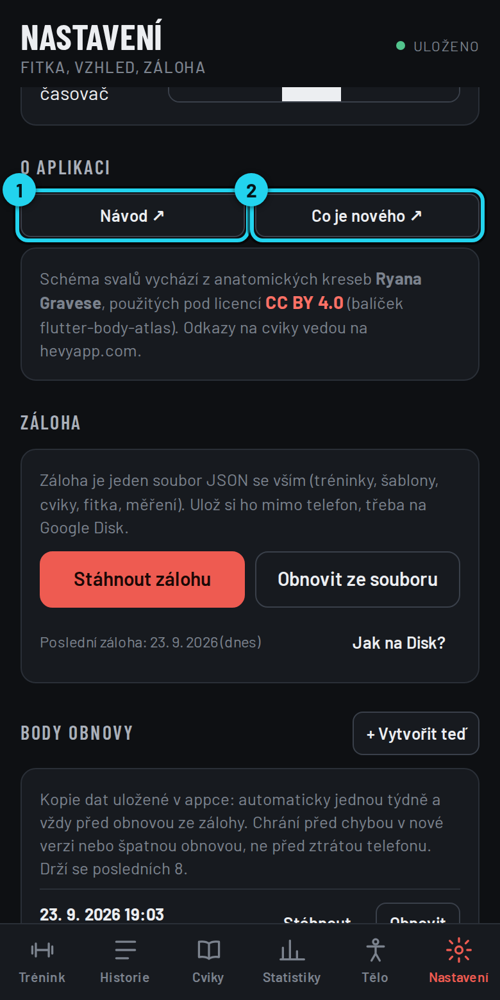

1. **Návod** – tento návod.
2. **Co je nového** – seznam změn podle verzí.

**Appka se neaktualizovala.**
Zavři ji (i ze seznamu spuštěných aplikací) a otevři znovu. Nová verze se stáhne
při otevření a appka se jednou sama znovu načte.

**Jak se počítá objem?**
Součet váha × opakování za pracovní série (bez zahřívacích). U cviků s vlastní vahou
se za váhu bere tvoje tělesná hmotnost, u shybů s dopomocí hmotnost minus dopomoc.

**Kdy vzniká rekord?**
Když v tréninku překonáš dosavadní nejlepší hodnotu: max. zátěž, odhad 1RM, nejlepší
série (váha × opakování), objem cviku, max. opakování (u cviků s vlastní vahou),
nejdelší výdrž, vzdálenost nebo tempo. Rekordy se počítají zpětně z celé historie.

**Změnil jsem u cviku partie nebo název. Nepřijdu o historii?**
Ne. Historie je navázaná na cvik, ne na jeho název. Tlačítko **Výchozí** vrátí
původní údaje z databáze.

**Světlý motiv**

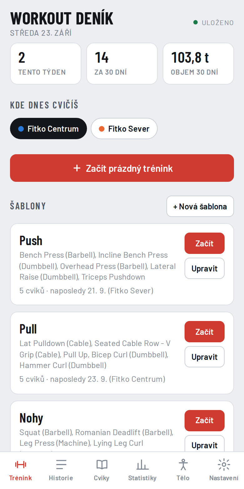

Přepíná se v **Nastavení → Vzhled → Motiv**.

---

*Obrázky v návodu se generují automaticky skriptem
[`snimky/snimky.js`](snimky/snimky.js) z ukázkových dat.*
