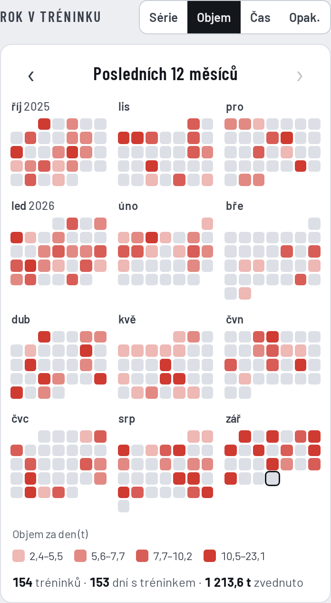
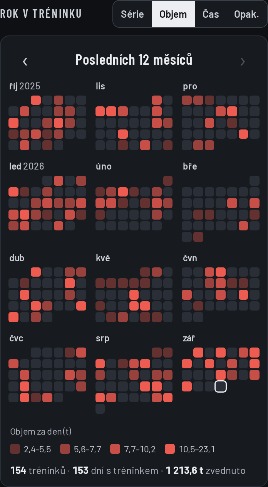
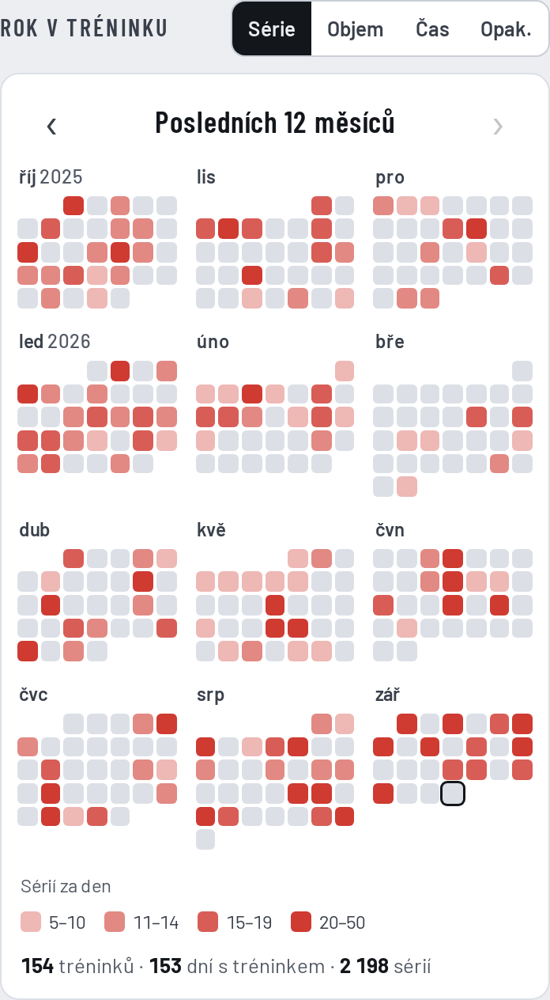
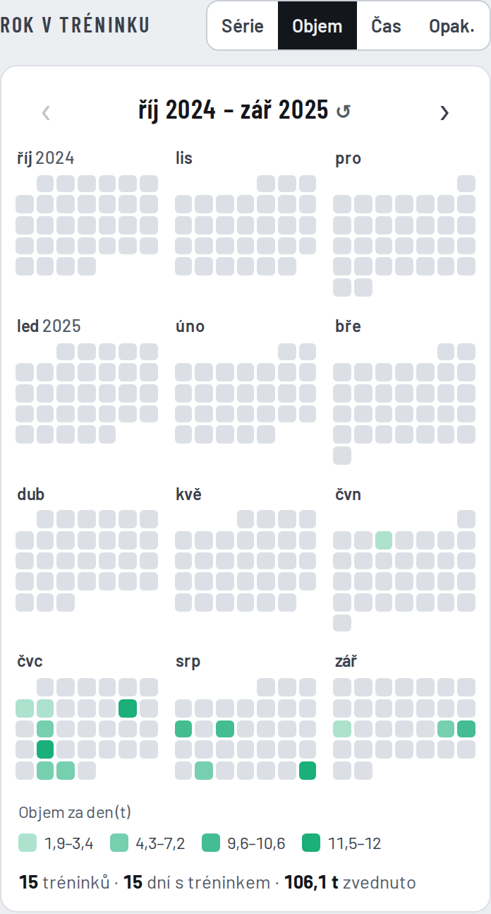
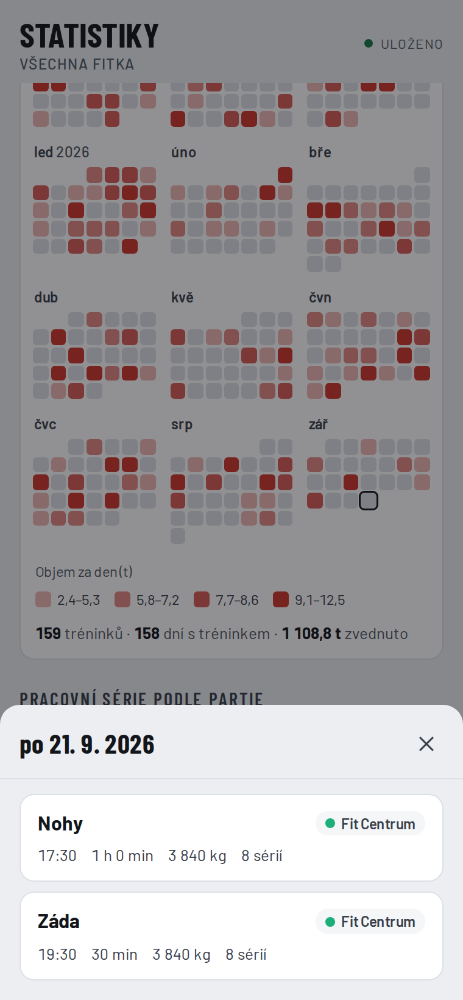
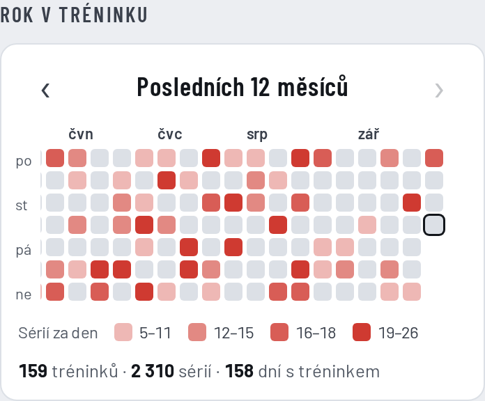
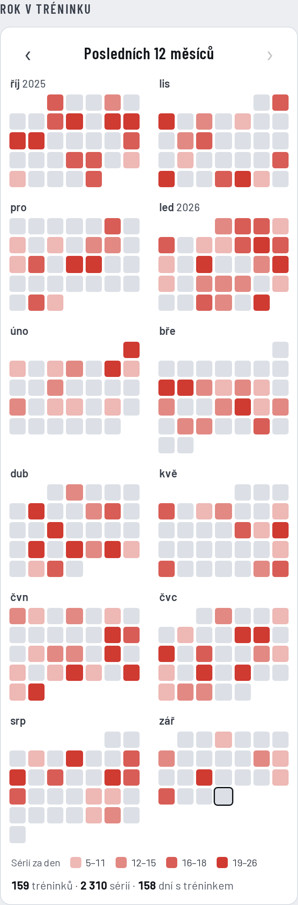

# F3-07 Roční heatmapa tréninků – odložený návrh

**Stav:** odloženo 24. 9. 2026. Tady je zapsaná celá diskuse, rozhodnutí a náhledy, aby se na ni dalo
navázat, pokud se úloha znovu otevře.

## Proč odloženo

Uživatel heatmapu po prohlédnutí náhledů odmítl jako samoúčelnou: je barevná a hezká, ale moc toho
neřekne. Většinu informací už appka ukazuje jinde:

- **kdy se cvičilo** ukazuje kalendář v Historii (F3-06), i s názvem tréninku,
- **kolik se cvičilo** ukazuje ve Statistikách graf Průběh (tréninky, série, objem, čas po týdnech
  nebo měsících), a to přesněji,
- heatmapa přidává jen celý rok na jeden pohled a odstíny, ze kterých se čísla nevyčtou.

Při znovuotevření nejdřív ujasnit, co má heatmapa říct navíc. Něco „s obsahem“ jsou spíš týdenní cíl
(F5-02) nebo měsíční shrnutí s porovnáním (F5-05).

## Co bylo navrženo a odsouhlaseno

| Otázka | Rozhodnutí |
|---|---|
| Rozložení na telefonu | **12 malých měsíců v mřížce 3 × 4** (varianta A), týden po–ne, čtverečky asi 12 px. Celý rok bez posouvání. |
| Období | **Posledních 12 měsíců** (dnešní měsíc je poslední), šipky ‹ › a **swipe** doleva/doprava po roce (jako kalendář). Starší rok jen, když jsou starší tréninky. Klepnutí na název období vrátí posledních 12 měsíců, při příchodu do Statistik vždy posledních 12 měsíců. |
| Podle čeho barvit | **Přepínač Série / Objem / Čas / Opakování**, výchozí **Objem**, volba se pamatuje. Víc tréninků v jednom dni se sečte, zahřívací série se nepočítají. |
| Odstíny | 4 odstíny podle **čtvrtin vlastních dní s tréninkem** v zobrazeném období, den s nejvíc je vždy nejsytější. Legenda ukáže skutečné rozsahy (objem **v tunách** s 1 desetinným místem, čas v minutách). |
| Barva | Všechna fitka = barva appky (červená), vybrané fitko = barva fitka. Prázdný den šedý, budoucí dny se nezobrazují, dnešek orámovaný. |
| Filtr | Řídí se filtrem fitek Statistik. **Na volbě období (7 dní … Vše) nezávisí** (výslovně odmítnuto propojení s obdobím i s volbou v grafu Průběh). |
| Klepnutí na den | Otevře trénink jako v kalendáři (`sheetCalDay`), víc věcí v jednom dni = výběr, Zpět se do něj vrátí. |
| Umístění | Statistiky, pod grafem Průběh. Stránka pak byla moc dlouhá, z toho vznikla úloha **F3-13** (rozdělení Statistik na části, v návrhu měla heatmapa vlastní část „Rok“). |
| Souhrn pod mřížkou | Počet tréninků, dní s tréninkem a součet zvoleného údaje („1 213,6 t zvednuto“, „173 h v posilovně“). |

Zmíněné nevýhody:

- čtverečky asi 12 px, trefit se do dne je těžší,
- Opakování nemají cviky na čas a vzdálenost, takové dny vyjdou světlejší,
- Čas podle délky tréninku zkreslí trénink, který omylem běžel dlouho (posune i hranice odstínů).

## Zamítnuté varianty rozložení

- **B – pás jako GitHub** (týdny jako sloupce): vejde se asi 4,5 měsíce, zbytek se posouvá do strany.
- **C – 2 měsíce vedle sebe**: větší čtverečky (asi 18 px), ale oddíl je asi 2,5 obrazovky dlouhý.

## Náhledy (vymyšlená data)

| | |
|---|---|
| Návrh, Objem, světlý motiv |  |
| Návrh, Objem, tmavý motiv |  |
| Návrh, Série |  |
| Vybrané fitko, o rok zpět |  |
| Klepnutí na den se 2 tréninky |  |
| Varianta B (pás) |  |
| Varianta C (2 měsíce) |  |

## Kód

Hotová implementace zůstala v historii PR dt-appdev/workout-denik#32 (větev `claude/happy-goldberg-y58xpj`),
do `main` se nedostala:

- `a339b7b` – první podoba (jen série),
- `6290375` – poslední podoba: přepínač údajů (`HEAT_M`, `wReps`), swipe (`heatSwipe`), výchozí Objem.

Hlavní části: sekce „ROČNÍ HEATMAPA (F3-07)“ v `js/app.js` (`vHeat(ws, g)`, `heatLevel`, `heatRange`,
`heatShift`, stav `S.heatOff` a `S.heatM`), styly `.hm*` v `css/app.css`, `sheetCalDay(k, noanim, g)`
s fitkem jako parametrem (akce `calDay` / `calW` / `calBody` s `data-g`). Kód vznikl před F3-11
(stupnice písma), při obnově převést velikosti písma na proměnné `--fs-…`. Obnovení např.
`git show 6290375` nebo `git cherry-pick a339b7b 6290375` a pak vyřešit rozdíly proti aktuálnímu `main`.
