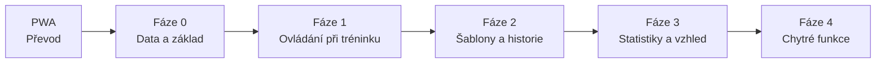

# Workout deník – plán vývoje

*Převedeno z dokumentu na claude.ai 23. 9. 2026 při přechodu na PWA + GitHub.*

## Jak s plánem pracovat

Jedna session v Claude Code = jedna úloha z plánu, označená ID (např. F1-01). Tento soubor je jediný zdroj pravdy o tom, co je hotové a co je na řadě.

1. V Claude Code otevři repo a napiš ID úlohy, např. „Udělej F0-02 z docs/plan-vyvoje.md".
2. Claude udělá změny ve vlastní větvi a otevře pull request.
3. Otestuješ v telefonu, dáš Merge.
4. Claude v rámci téhož PR zaškrtne úlohu a přidá řádek do logu na konci tohoto souboru.

Pravidla pro každou úpravu:

- Jedna úloha = jedna větev = jeden pull request.
- Stará data se nesmí ztratit: nová pole mají výchozí hodnoty, uložená data se při načtení automaticky doplní.
- Před větší změnou si v appce udělat zálohu dat.
- Jen zdarma: offline, bez serveru, bez placených API a knihoven. Kód na GitHubu, hosting na GitHub Pages, data jen v telefonu.

## Kontext appky

Workout deník je osobní HTML appka (PWA) pro zápis tréninků ve fitku na Androidu, inspirovaná Hevy. Historie je importovaná z CSV exportu Hevy.

Data jsou uložená v telefonu (IndexedDB). Záloha mimo telefon řeší F0-01 (export JSON, sdílení na Disk / e-mail).

Klíčové specifikum: cvičím ve **více fitkách** a stejný stroj má v každém jiný odpor. Statistiky, grafy a předvyplňování hodnot proto musí jít oddělit podle fitka.

Původní zadání:

- Progres cviků, rozlišení warm-up a pracovních sérií, statistiky s volbou období (týden, měsíc, 3/6 měsíců, rok, vše).
- Databáze cviků s popisem nebo obrázkem, doplněná z Hevy, česko-anglické názvy.
- Šablony tréninků, vytvoření šablony z odcvičeného tréninku.
- Odpočinkový časovač se zvukem a ±15 s.
- Tělesná měření (váha, % svalů, % tuku).

## Priority a pořadí

Pořadí: nejdřív ochrana dat, pak pohodlí při samotném tréninku, pak šablony, statistiky a nakonec chytré funkce. Úlohy uvnitř fáze jsou seřazené podle priority, dělají se shora dolů.

### Převod na PWA

- [x] **PWA-01** Převod z artefaktu na PWA na GitHub Pages: IndexedDbBackend místo databáze artefaktu, stahování zálohy a body obnovy bez API artefaktu, manifest, service worker, ikony, CLAUDE.md.

### Fáze 0 – Data a základ

Bez zálohy hrozí ztráta celé historie a bez svalových partií u cviků nejdou udělat statistiky ve fázi 3.

- [x] **F0-01** Záloha jedním klepnutím: export a import JSON, sdílení přes Android (Drive, e-mail), připomínka po X dnech bez zálohy.
- [x] **F0-02** Databáze cviků: ke každému cviku primární a sekundární svalové partie.
- [x] **F0-03** Přidání cviku vyhledáním v otevřené databázi (free-exercise-db, případně wger): napíšu název, appka nabídne cviky a předvyplní partie, vybavení, popis a návrh českého názvu. Stačí online.
- [x] **F0-04** Verze appky v Nastavení: zobrazit, jakou verzi právě používám – vydaná verze (z `main`), nebo testovací verze před merge (s názvem větve / PR) – a datum a čas verze. Pomůže při testování PR na telefonu poznat, že se appka opravdu aktualizovala.
- [x] **F0-05** Záložka Cviky: nová záložka ve spodní liště vedle Trénink, Historie, Statistiky, Tělo a Nastavení s databází cviků. Procházení, hledání a filtr podle partie, otevření detailu cviku a úprava (název CZ/EN, partie, popis…) bez nutnosti chodit přes přidání cviku do tréninku nebo přes statistiky. Nahradí tlačítko „Spravovat" v Nastavení → Databáze cviků.
- [x] **F0-06** Systémové tlačítko Zpět (Android): vrátí o krok zpět v appce místo zavření. Pořadí: zavřít otevřený panel (sheet) → ze stránky cviku nebo úpravy tréninku zpět, odkud se přišlo → z jiné záložky na Trénink. Na hlavní obrazovce Tréninku se appka zavře až po druhém stisku (hláška „Stiskni Zpět ještě jednou pro zavření"). Rozdělaný trénink se tlačítkem Zpět nikdy neukončí ani nesmaže. Technicky přes historii prohlížeče (`history.pushState` + `popstate`), zdarma a offline.
- [x] **F0-07** Měnitelné pořadí fitek v Nastavení (šipky ↑/↓ u fitka). Pořadí se promítne všude, kde se fitka vybírají (začátek tréninku, filtry v Historii a Statistikách). Barva fitka se dnes počítá z jeho pořadí, takže se při přesunu nesmí změnit: každé fitko dostane uloženou barvu (výchozí = barva podle dnešního pořadí, doplní se automaticky při načtení).

### Fáze 1 – Ovládání při tréninku

Největší přínos při každém tréninku, většinou malé úpravy.

- [x] **F1-01** „Minule" u každé série: hodnoty z posledního tréninku v tomtéž fitku, předvyplněné.
- [ ] **F1-02** Displej nezhasne během tréninku (Wake Lock).
- [ ] **F1-03** Velká tlačítka +/− pro váhu a opakování, ovládání jednou rukou.
- [x] **F1-04** Časovač počítaný z času startu (nevypadne na pozadí) a vibrace na konci pauzy.
- [ ] **F1-05** Pokračování rozdělaného tréninku po zavření prohlížeče.
- [ ] **F1-06** Přidávání cviku: naposledy cvičené nahoře, sekce „cvičil jsi v tomto fitku", hledání bez diakritiky v CZ i EN názvu (hledání bez diakritiky hotové už v F0-05).
- [ ] **F1-07** Poznámky ke stroji podle fitka (nastavení sedačky, opěrky).
- [ ] **F1-08** U warm-up série tlačitko "60%", které přednastaví váhu v sérii na 60% maxima z minula, následna editace je zachována
- [ ] **F1-09** Délka pauzy podle cviku (jako v Hevy, např. dřep 3 min, biceps 1 min), jinak výchozí časovač z Nastavení. Zatím odloženo, rozhodnout později (vzniklo u F1-04).

### Fáze 2 – Šablony a historie

- [x] **F2-01** „Cvičit znovu" z historie: spustí trénink bez nutnosti vytvářet šablonu.
- [ ] **F2-02** Šablony podle fitka: přiřazení k fitkům, šablony pro aktuální fitko nahoře, ostatní sbalené.
- [ ] **F2-03** Swipe pro dokončení série, tlačítko Zpět po smazání.
- [ ] **F2-04** Rotace programu: appka ukáže, která šablona je na řadě.
- [ ] **F2-05** Vlastní fotky u cviku: přidání z galerie nebo fotoaparátu, více fotek na cvik, volitelně přiřazené k fitku (fotka stroje). Na stránce cviku galerie v místě schématu postavy, swipe doprava na další fotku, tečky ukazují pozici. Fotky zmenšené a uložené v IndexedDB, fotka stroje z aktuálního fitka se ukáže jako první.

### Fáze 3 – Statistiky a vzhled

Předpoklad: F0-02 (svalové partie).

- [ ] **F3-01** Barva a ikona fitka, tmavý režim, barvy svalových partií. Víc barev pro fitka než dnešních 6 (rozhodnuto u F0-07: 6 je málo); barva je už uložená u fitka jako číslo barvy z palety (`g.col`), stačí paletu rozšířit a přidat výběr v okně Upravit fitko.
- [ ] **F3-02** Osobní rekordy (max váha, max opakování, odhad 1RM podle Epleyho) s oznámením při překonání.
- [x] **F3-03** Souhrn po tréninku: čas, objem, série, rekordy, rozdíl proti minulému běhu stejné šablony.
- [ ] **F3-04** Radar svalových partií ve statistikách: aktuální vs předchozí období, filtr fitka, karty s rozdíly (tréninky, čas, objem, série), klepnutí na osu ukáže cviky.
- [ ] **F3-05** Radar v souhrnu po tréninku: volitelné, přepínatelné doplnění ke schématu postavy (F3-03), ne jeho náhrada.
- [x] **F3-06** Kalendář (měsíc): kolečko v barvě fitka, pod ním název šablony, týdenní streak, počet volných dnů, klepnutí otevře detail, ikona u dne s měřením.
- [ ] **F3-07** Roční heatmapa tréninků (barva podle počtu sérií).

### Fáze 4 – Chytré funkce

- [ ] **F4-01** Návrh progrese (double progression): po splnění horní hranice opakování navrhne +2,5 kg.
- [ ] **F4-02** Generátor rozcvičkových sérií z pracovní váhy.
- [ ] **F4-03** Kalkulačka kotoučů na osu.
- [ ] **F4-04** RIR/RPE u série (volitelné).
- [ ] **F4-05** Supersérie se společnou pauzou.
- [ ] **F4-06** Upozornění na stagnaci (3–4 tréninky bez zlepšení).
- [ ] **F4-07** Plánované tréninky v kalendáři.
- [ ] **F4-08** Sdílení souhrnu tréninku jako obrázek.
- [ ] **F4-09** Export do CSV pro Excel.

## Co neděláme

| Nápad | Proč ne |
|---|---|
| Spálené kalorie při tréninku | Odhad přes MET má u posilování chybu ±30–50 %, bez tepu nemá vypovídací hodnotu a svádí k „dojídání". Náhrada: trend tělesné váhy. |
| Sledování jídla a příjmu kalorií | Samostatná velká aplikace, na to existují specializované appky. |
| Napojení na hodinky / Health Connect | Z webové appky nedostupné, jen z nativní aplikace. |
| Cloud, server, synchronizace dat | Jen offline a zdarma, data zůstávají v telefonu, zálohu řeší F0-01. (GitHub slouží jen pro kód a hosting.) |

Odloženo (vrátit se, až bude fáze 3 hotová):

- Automatická volba fitka podle GPS: ruční volba stačí, GPS vyžaduje oprávnění a baterii.
- Silueta postavy obarvená podle zatížení ve Statistikách: radar (F3-04) pokryje totéž jednodušeji. (V souhrnu po tréninku je postava od F3-03.)
- Jemnější dělení partií (biceps/triceps, kvadricepsy/hamstringy/hýždě): podle odpovědi na otevřenou otázku.

## Otevřené otázky

Rozhodnout nejpozději v session dané úlohy. U každé je návrh výchozí volby.

| Úloha | Otázka | Návrh |
|---|---|---|
| F0-02 | Obsahuje databáze cviků už svalové partie, nebo je doplníme? | Vyřešeno 23. 9.: partie všech 388 cviků zkontrolované a schválené, výchozí databáze je součástí appky. |
| F0-03 | Zdroj, český název, popis, fotky? | Vyřešeno 23. 9.: jen free-exercise-db (kopie v repu, volné dílo), wger odloženo. Hotové české názvy všech 876 cviků, popis anglicky, hledání česky i anglicky, u stejného cviku upozornění „už máš“, fotky jen náhled (ukládání až F2-05). |
| F0-04 | Jak dostat testovací verzi (před merge) do telefonu? GitHub Pages teď nasazuje jen `main`. | Vyřešeno 23. 9.: GitHub Actions nasadí každý otevřený PR do `…/workout-denik-test/pr-N/` (samostatné repo, aby šla testovací verze nainstalovat) s vlastními daty (kopie z vydané verze tlačítkem), oranžovým pruhem a ikonou TEST; verze a čas se doplní automaticky. |
| F0-05 | Bude spodní lišta se 6 záložkami na telefonu ještě pohodlná? | Vyřešeno 23. 9.: 6 záložek s popisky, menší písmo; Cviky mají ikonu otevřené knihy (činka zůstává Tréninku). |
| F0-06 | Co má Zpět udělat na hlavní obrazovce Tréninku? | Vyřešeno 23. 9.: první stisk ukáže hlášku, druhý appku zavře, dokud se mezitím nedotkneš displeje (klepnutí i swipe) (limit 2 s Chrome neumožní spolehlivě hlídat) |
| F0-07 | Ruční pořadí, nebo automaticky podle počtu návštěv? | Vyřešeno 23. 9.: ruční, šipky ↑/↓ přímo v řádku fitka; výchozí fitko zůstává zvlášť; nové fitko dostane první volnou barvu; „Podle fitek“ ve Statistikách dál podle počtu tréninků; 6 barev je málo, řeší F3-01. |
| F1-01 | Šedé, nebo černé předvyplnění? Co v novém fitku? Hodnoty ze šablony? Víc sérií než minule? | Vyřešeno 23. 9.: šedé (✓ převezme); cvik vázaný na fitko bez záznamu v tomto fitku = prázdné, jen info „V jiném fitku (…)“; hodnoty ze šablony jen u nikdy necvičeného cviku; série bez záznamu z minula = „–“ ve sloupci Minule i v políčkách; „minule“ = poslední trénink s cvikem (ne běh šablony); sloupec Minule jen informace; univerzální cviky dál z kteréhokoli fitka. |
| F1-04 | Jak upozornit na konec pauzy, když je appka na pozadí nebo displej zhasnutý? | Vyřešeno 23. 9.: systémové oznámení ze service workeru („Další: cvik · N. série“), vypínatelné v Nastavení; v appce na konci 2 dlouhé vibrace a pípnutí (volba zvuk / vibrace / obojí); přečas „+0:25“ vypínatelný; pauza po zahřívací sérii stejná; oznámení při startu pauzy ne; délka pauzy podle cviku odložena jako F1-09. Se zamčeným displejem může oznámení přijít pozdě (Android uspí procesor); udržování telefonu vzhůru neslyšitelným tónem zamítnuto. |
| F2-01 | „Cvičit znovu" z tréninku v jiném fitku: spustit v aktuálním, nebo původním fitku? | Vyřešeno 23. 9.: před startem okno s volbou fitka (předvybrané aktuální); počet a druh sérií z vybraného tréninku, hodnoty šedě z minula ve zvoleném fitku (F1-01); vazba na šablonu zůstává, „Aktualizovat šablonu“ nezaškrtnuté; poznámky ke cvikům jen ve stejném fitku; tlačítko jen v detailu tréninku. |
| F2-02 | Mají mít šablony různé výchozí váhy pro každé fitko? | Ne, stačí F1-01 |
| F3-06 | Kde kalendář, co pod kolečkem, streak, volné dny, filtr fitek, klepnutí na den? | Vyřešeno 23. 9.: Historie s přepínačem Kalendář / Seznam, kalendář na prvním místě a výchozí (volba se pamatuje), otevře se vždy aktuální měsíc; pod kolečkem název tréninku (ne šablony), zalomený na 2 řádky; víc tréninků v jednom dni = kolečko rozdělené na barvy fitek a „2ד; streak = týdny po sobě aspoň s 1 tréninkem; volné dny = dny od posledního tréninku (nahoře) i počet v měsíci (dole); filtr fitek skryje tréninky jiných fitek, streak a volné dny vždy ze všech fitek; měření = tečka; den s jednou věcí se otevře rovnou, s víc věcmi (i trénink + měření) výběr; rozdělaný trénink čárkovaně. |
| F2-05 | Zahrnout fotky do zálohy (F0-01)? Záloha tím naroste o jednotky až desítky MB. | Přepínač „s fotkami / bez fotek" (formát zálohy v2 už má připravené pole pro fotky) |
| F3-03 | Porovnat s minulým během šablony v jakémkoli fitku, nebo ve stejném? Rozdíl u cviku proti čemu? | Vyřešeno 23. 9.: minulý běh šablony přednostně ve stejném fitku (jinak odjinud s poznámkou „jiné fitko“), shoda podle šablony, jinak podle názvu (ne automatického) nebo zdroje „Cvičit znovu“; u cviku poslední výskyt cviku i z jiné šablony (vázaný cvik jen ve stejném fitku); postava s procvičenými partiemi bez čísel a legendy; souhrn i u starších tréninků v Historii. |
| F3-04 | Osy radaru podle sérií, nebo přepínač série ↔ objem? | Pracovní série, sekundární partie × 0,5 |
| F3-04 | 6 hlavních partií, nebo jemnější dělení? | 6 partií |
| vše | Co z původního zadání už appka umí (tmavý režim, časovač, měření)? | Ověřeno 23. 9.: tmavý režim, časovač se zvukem a ±15 s i tělesná měření appka už umí |

## Log

Nejnovější nahoře. Po každé otestované úloze přidat řádek.

| Datum | Úloha | Poznámka |
|---|---|---|
| 24. 9. 2026 | F3-06 | Po testu na telefonu: kalendář je v Historii na prvním místě (přepínač Kalendář / Seznam) a otevře se jako výchozí; kdo si přepne na Seznam, tomu se to pamatuje. |
| 23. 9. 2026 | F3-06 | Kalendář v Historii (přepínač Seznam / Kalendář, pamatuje se): měsíc po–ne, kolečko v barvě fitka, pod ním název tréninku na 2 řádky, víc tréninků v jednom dni = kolečko rozdělené na barvy a „2ד, tečka = měření, dnešek orámovaný, rozdělaný trénink čárkovaně. Nahoře týdenní streak (týdny po sobě aspoň s 1 tréninkem, rozběhnutý týden řadu nepřeruší) a dny od posledního tréninku, dole souhrn měsíce (tréninky, volné dny, dny s měřením). Filtr fitek skryje tréninky jiných fitek, streak a volné dny vždy ze všech fitek. Klepnutí na den otevře trénink nebo měření, při víc věcech výběr (Zpět se do něj vrátí). Měsíce šipkami nebo swipem, klepnutí na název měsíce vrátí aktuální měsíc; při příchodu do Historie vždy aktuální měsíc. Budoucí dny zatím neaktivní (F4-07). Data ani formát zálohy beze změny. |
| 23. 9. 2026 | F3-03 | Souhrn po tréninku v panelu tréninku (po uložení „Hotovo · …“ i z Historie): karty Čas, Objem, Série, Rekordy s rozdílem proti minulému běhu stejné šablony (přednostně ve stejném fitku), řádek „Porovnáno s …“ (klepnutím otevře minulý trénink, Zpět vrátí) a „Minule navíc“ s cviky, které tentokrát chyběly. Nová část „Procvičené partie“: postava zepředu/zezadu obarvená podle počtu sérií a pruhy s poměrem partií. U každého cviku nejlepší série a objem (u cviků na čas celkový čas, u vzdálenosti km) proti poslednímu výskytu cviku, i z jiného tréninku; štítek „Poprvé“. Rozdíly všude stejně: ▲ víc (zeleně), ▼ míň (červeně), ◄► 0 beze změny (u času jen šedě); datum minula s rokem, když je z jiného roku. Rekordy v souhrnu seskupené po cvicích (název cviku na řádku, pod ním jednotlivé rekordy). „Cvičit znovu“ si nově pamatuje původní trénink (`againOf`), aby šel porovnat i trénink bez šablony. Formát zálohy beze změny. |
| 23. 9. 2026 | F1-04 | Záznam oznámení jen pro vývoj: vede se a je vidět (Nastavení → Verze aplikace) jen v testovací verzi PR a lokálně, ve vydané verzi není. |
| 23. 9. 2026 | F1-04 | Záznam z telefonu ukázal, že se zamčeným displejem Android uspí procesor a oznámení se někdy zpozdí o desítky sekund (2 ze 4 pokusů), při přepnutí do jiné aplikace chodí včas. Webová appka neumí telefon probudit v přesný čas (to umí jen nativní aplikace). Pokus s neslyšitelným tónem, který by telefon držel vzhůru, zamítnut, omezení se přijímá: po odemčení appka hned ukáže přečas. Záznam oznámení v Nastavení zůstává. |
| 23. 9. 2026 | F1-04 | Oprava po testu na telefonu (se zamčeným displejem oznámení nepřišlo): oznámení se vynechá, jen když je appka viditelná a zároveň aktivní (dřív stačilo „viditelná“). Nový Záznam oznámení v Nastavení (kdy se oznámení naplánovalo, zobrazilo, se zpožděním, nebo vůbec, a kdy šla appka na pozadí) pro hledání příčiny. |
| 23. 9. 2026 | F1-04 | Časovač pauzy přežije zavření appky i automatickou aktualizaci (uložený v telefonu, počítá se z času konce). Na konci pauzy v appce 2 dlouhé vibrace a pípnutí (Nastavení: zvuk i vibrace / zvuk / vibrace). Když je appka na pozadí nebo displej zhasnutý, přijde oznámení Androidu „Odpočinek skončil · Další: cvik · N. série“ (service worker, Chrome ho udrží nejvýš asi 5 min), klepnutí otevře appku; po návratu už nepípá a oznámení zmizí. O povolení oznámení se appka zeptá při první pauze, v Nastavení je přepínač, stav povolení a tlačítko Vyzkoušet. Nově přečas „+0:25“ po konci pauzy (vypínatelný), zmizí odškrtnutím další série, Zavřít nebo po 15 min. Nastavení jsou v `config/main` s výchozími hodnotami, formát zálohy beze změny. Do plánu přidána F1-09 (délka pauzy podle cviku). |
| 23. 9. 2026 | F0-06 | Oprava: přepnutí záložky z úpravy tréninku nebo šablony (i ze stránky cviku otevřené z úpravy) už neuložené změny nezahodí potichu, ale zeptá se „Zahodit změny?“ stejně jako Zpět. Bez změn se záložka přepne rovnou. |
| 23. 9. 2026 | F2-01 | „Cvičit znovu“ v detailu tréninku v Historii (ne v okně Hotovo po dokončení): okno s volbou fitka (předvybrané aktuální, upozornění, když byl trénink v jiném fitku), pak nový trénink se stejným názvem a cviky. Počet a druh sérií z vybraného tréninku, hodnoty šedě z minula ve zvoleném fitku (jako u šablony, F1-01). Poznámky ke cvikům jen ve stejném fitku, cvik, který už v appce není, se vynechá. Vazba na šablonu zůstává (naposledy u šablony), „Aktualizovat šablonu“ při dokončení je nezaškrtnuté. Při rozdělaném tréninku jen hláška. Oprava: šablona z tréninku, aktualizace šablony při dokončení a úprava šablony už neztrácí čas a vzdálenost (plank, běh). Data ani formát zálohy beze změny. |
| 23. 9. 2026 | F1-01 | „Minule“ podle fitka: série se párují podle druhu (zahřívací se zahřívací, pracovní s pracovní), takže zahřívací série už neposunou porovnání. Hodnoty z minula v aktuálním fitku jsou v políčkách šedě a klepnutí na ✓ je převezme; zapsané číslo je bílé/černé. Ani šablona už nepředvyplní váhy natvrdo (počet a druh sérií ano, hodnoty jen u cviku, který jsi nikdy necvičil). Přepnutí fitka během tréninku šedé hodnoty přepočítá. Cvik vázaný na fitko bez záznamu v tomto fitku ukáže jen informaci „V jiném fitku (…)“. Série bez záznamu z minula (navíc oproti minule, nové fitko) má „–“ ve sloupci Minule i v políčkách, hodnoty ze série nad ní se nepřebírají. Oprava: při úpravě starého tréninku se „Minule“ bere z tréninku před ním. Data ani formát zálohy beze změny. |
| 23. 9. 2026 | F0-06 | Systémové tlačítko Zpět (i gesto): panel o úroveň zpět nebo zavřít, stránka cviku a úprava tréninku/šablony zpět tam, odkud se přišlo (i do otevřeného panelu, např. detail tréninku nebo výběr cviků se zaškrtnutými cviky, a na stejné místo seznamu), jiná záložka → Trénink. Na hlavní obrazovce Tréninku první Zpět ukáže hlášku, druhý appku zavře (dokud se mezitím nedotkneš displeje; klepnutí i swipe hlášku hned schová a pojistku obnoví). Úprava se změnami se zeptá „Zahodit změny?“. Šipka ← v appce dělá totéž. Zapojené i panely hledání v online databázi (F0-03): výsledky → formulář a zpět, ze stránky cviku zpět do výsledků. Rozdělaný trénink Zpět nikdy neukončí. Data ani formát zálohy beze změny. |
| 23. 9. 2026 | F0-07 | Pořadí fitek se mění šipkami ↑/↓ v Nastavení → Fitka a platí všude (začátek tréninku, úprava tréninku, filtry v Historii a Statistikách, přepínač a graf na stránce cviku). Každé fitko má uloženou barvu (`col`, 1–6), při prvním načtení se doplní podle dosavadního pořadí, takže se nic nepřebarví; barva se nemění ani přesunem, ani smazáním jiného fitka. Nové fitko dostane první volnou barvu, při sloučení zálohy se kolize barvy vyřeší stejně. Formát zálohy beze změny. |
| 23. 9. 2026 | F0-03 | Hledání cviků v online databázi free-exercise-db (876 cviků, kopie v `js/fedb.js`, načte se až při prvním hledání, pak funguje i offline). Tlačítko „Hledat v online databázi“ ve výběru cviků, v záložce Cviky a ve formuláři Nový cvik. Hledá se česky i anglicky, posilovací cviky nahoře, protahování/kardio/plyometrie na přepínač. Výběr předvyplní formulář (název, český název, partie – nejvýš 3 pomocné, vybavení, typ zápisu, vázáno na fitko, anglický popis). U cviků, které už v appce jsou, „Už máš“ s tlačítkem Vybrat/Otevřít (224 shod s výchozí databází). Vlastní cvik dostane značku `src`, formát zálohy beze změny. Popis cviku nově zachovává řádky. wger odloženo. |
| 23. 9. 2026 | F0-04 | Oprava: testovací verze nešla v Androidu nainstalovat („aplikace už je nainstalována“), protože adresa `…/workout-denik/pr-N/` patří nainstalované vydané appce. Testovací verze se proto nasazují do samostatného repa `workout-denik-test` (`…/workout-denik-test/pr-N/`, rozcestník v kořeni), nahrávají se tokenem v secretu `TEST_REPO_TOKEN`. Vydaná verze se nasazuje jen při změně v `main`. Komentář s odkazem se aktualizuje u všech nasazených PR. Data testovacích verzí zůstávají oddělená (stejná doména). |
| 23. 9. 2026 | F0-04 | Nasazení přes GitHub Actions: `main` = vydaná verze, každý otevřený PR = testovací verze v `…/pr-N/` (odkaz v komentáři PR, po zavření PR zmizí). Testovací verze má vlastní data (IndexedDB `workout-denik-prN`, prefix `zd1-prN:`), tlačítko „Zkopírovat data z vydané verze“, oranžový pruh nahoře, oranžový stavový řádek a vlastní ikonu TEST (jde nainstalovat zvlášť). Nastavení → Verze aplikace: vydaná / testovací verze, čas nasazení, kód změny, „Zkontrolovat aktualizaci“; ve vydané verzi úklid dat testovacích verzí. Verze appky se doplňuje automaticky (`js/verze.js`), ruční zvyšování `VERSION` v `sw.js` zrušeno. Service worker maže jen své cache a neobsluhuje adresy `pr-N`. Formát dat ani zálohy beze změny. Před sloučením nutné přepnout Settings → Pages → Source na GitHub Actions. |
| 23. 9. 2026 | – | Do CLAUDE.md přidáno pravidlo pro souběžnou práci na víc úlohách: před dokončením PR sloučit aktuální `main` do větve a vyřešit konflikty (vyšší `VERSION`, v logu nechat řádky z obou větví). |
| 23. 9. 2026 | – | Do plánu přidány úlohy F0-06 (systémové tlačítko Zpět) a F0-07 (měnitelné pořadí fitek). |
| 23. 9. 2026 | F0-05 | Nová záložka Cviky (6. ve spodní liště, ikona kniha): všechny cviky, nahoře cvičené; řazení Naposledy / A–Z; filtr partie a vybavení (pamatuje se), filtr Skryté; + Nový cvik. Hledání všude bez ohledu na diakritiku. Stránka cviku rozdělená na Popis a Statistiky: ze záložky Cviky a z výběru cviku se otevře Popis, ze Statistik, Historie a tréninku Statistiky. „Spravovat“ z Nastavení odstraněno. Data ani formát zálohy beze změny. |
| 23. 9. 2026 | – | Do plánu přidány úlohy F0-04 (verze appky v Nastavení) a F0-05 (záložka Cviky). |
| 23. 9. 2026 | F0-02 | Výchozí databáze 388 cviků je součástí appky (`js/cviky.js`), v telefonu se ukládají jen vlastní úpravy, skryté a vlastní cviky. Partie zkontrolované podle free-exercise-db a wger a schválené: ramena jako jedna partie, nejvýš 3 pomocné partie, jen svaly, které opravdu pracují (32 úprav, 120× jen sloučení ramen). Převod dat v telefonu jednou automaticky, předtím bod obnovy. V úpravě cviku tlačítko „Výchozí". Vyhledávání v otevřených databázích přesunuto do nové úlohy F0-03. |
| 23. 9. 2026 | PWA-01 | Appka převedena na PWA (GitHub Pages): data v IndexedDB, body obnovy v IndexedDB, stahování zálohy přes Chrome, písma a ikony v repu, service worker s verzovanou cache a automatickou aktualizací, CLAUDE.md a README. Vzhled a funkce beze změny. Zbývá: převést data z artefaktu (záloha → obnova) a otestovat na telefonu. |
| 23. 9. 2026 | – | Rozhodnuto o přechodu z artefaktu na PWA hostovanou na GitHub Pages. Plán převeden do repa. Další na řadě: PWA-01, pak F0-02. |
| 23. 9. 2026 | F0-01 | Záloha hotová (verze 9 artefaktu): pruh s připomínkou po 7 dnech bez zálohy, po stažení návod na Disk, obnova „sloučit" nebo „nahradit vše", body obnovy v appce (týdně, před obnovou, ručně; drží se 8), formát zálohy v2 s místem pro fotky. Otestováno na simulovaných datech, zbývá ověřit v Chromu na telefonu. |
| 23. 9. 2026 | – | Brainstorming dokončen, plán a priority sepsány. |
