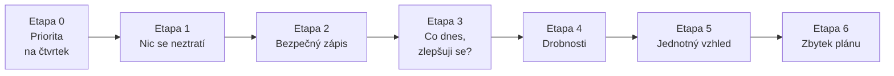

# Workout deník – plán vývoje

*Převedeno z dokumentu na claude.ai 23. 9. 2026 při přechodu na PWA + GitHub.*

## Jak s plánem pracovat

Jedna session v Claude Code = jedna úloha z plánu, označená ID (např. F1-01). Tento soubor je jediný zdroj pravdy o tom, co je hotové a co je na řadě. Hotové úlohy jsou tu jen jedním řádkem, celé popisy a vyřešené otázky jsou v [hotovo.md](hotovo.md), log v [log.md](log.md).

1. V Claude Code otevři repo a napiš ID úlohy, např. „Udělej F0-02 z docs/plan-vyvoje.md".
2. Claude nejdřív popíše, jak bude funkce fungovat a co se změní, výhody, nevýhody a dopady na další vývoj, a položí doplňující otázky. Implementovat začne až na výslovný pokyn.
3. Claude udělá změny ve vlastní větvi a otevře pull request.
4. Otestuješ v telefonu, dáš Merge.
5. Claude v rámci téhož PR zaškrtne úlohu (zkrátí ji na jeden řádek, celý popis přesune do `hotovo.md`) a přidá řádek do `log.md`.

Pravidla pro každou úpravu:

- Jedna úloha = jedna větev = jeden pull request.
- Stará data se nesmí ztratit: nová pole mají výchozí hodnoty, uložená data se při načtení automaticky doplní.
- Před větší změnou si v appce udělat zálohu dat.
- Jen zdarma: offline, bez serveru, bez placených API a knihoven. Kód na GitHubu, hosting na GitHub Pages, data jen v telefonu.

## Kontext appky

Workout deník je osobní HTML appka (PWA) pro zápis tréninků ve fitku na Androidu, inspirovaná Hevy. Historie je importovaná z CSV exportu Hevy.

Data jsou uložená v telefonu (IndexedDB). Záloha mimo telefon řeší F0-01 (export JSON, sdílení na Disk / e-mail).

Klíčové specifikum: cvičím ve **více fitkách** a stejný stroj má v každém jiný odpor. Statistiky, grafy a předvyplňování hodnot proto musí jít oddělit podle fitka.

Původní zadání:

- Progres cviků, rozlišení warm-up a pracovních sérií, statistiky s volbou období (týden, měsíc, 3/6 měsíců, rok, vše).
- Databáze cviků s popisem nebo obrázkem, doplněná z Hevy, česko-anglické názvy.
- Šablony tréninků, vytvoření šablony z odcvičeného tréninku.
- Odpočinkový časovač se zvukem a ±15 s.
- Tělesná měření (váha, % svalů, % tuku).

## Priority a pořadí

Pořadí: nejdřív ochrana dat, pak pohodlí při samotném tréninku, pak šablony, statistiky, chytré funkce a nakonec motivace. Fáze třídí úlohy podle témat; kdy se která úloha dělá, určují etapy níže.

### Etapy podle naléhavosti

Aktuální pořadí dalších úloh (zhodnoceno 27. 9. 2026 podle nezávislého UX auditu, má přednost před pořadím ve fázích). Úlohy jsou rozdělené do etap podle naléhavosti. V etapě se dělají shora dolů; úlohy, které na sobě nezávisí, jdou dělat souběžně (každá ve své větvi). Fáze níže zůstávají tématické (kam úloha patří), etapy říkají, kdy se dělá.

Značky u úloh z auditu (celý audit a přiřazení všech nálezů k úlohám v `docs/navrhy/ux-audit-2026-09-27.md`):

- **P1–P3** naléhavost: P1 výrazně zhoršuje zápis tréninku nebo tiše ztrácí data, P2 zhoršuje používání, P3 drobnost. (P0 = nejde používat nebo se ztrácí data; audit žádné nenašel.)
- **A–D** druh nálezu: A objektivní problém, B silné doporučení, C vkus, D rozhodnutí vlastníka (u takových úloh je otázka v části Otevřené otázky).
- Náročnost: velmi nízká / nízká (hodiny) / střední.

```mermaid
flowchart LR
  E0[Etapa 0<br/>Priorita<br/>na čtvrtek] --> E1[Etapa 1<br/>Nic se neztratí]
  E1 --> E2[Etapa 2<br/>Bezpečný zápis]
  E2 --> E3[Etapa 3<br/>Co dnes,<br/>zlepšuji se?]
  E3 --> E4[Etapa 4<br/>Drobnosti]
  E4 --> E5[Etapa 5<br/>Jednotný vzhled]
  E5 --> E6[Etapa 6<br/>Zbytek plánu]
```

#### Etapa 0 – Priorita uživatele (zapsáno 30. 9. 2026, začít ve čtvrtek 1. 10. 2026)

Šest změn z používání, mají přednost před etapami 1–6. Každá úloha = vlastní větev a PR; před implementací podle pravidla v `CLAUDE.md` nejdřív popis a otázky (návrhy výchozích voleb v Otevřených otázkách). Doporučené pořadí (F2-11 a F1-19 se dotýkají stejného kódu předvyplnění `exHints`, proto za sebou, ne souběžně):

- ~~**F2-10** Poznámka ke cviku v šabloně a z historie~~ – hotovo 30. 9. 2026.
- ~~**F1-19** Minule jako text u cviku místo sloupce~~ – hotovo 30. 9. 2026.
- ~~**F2-11** Předvyplnění ze šablony a z historie místo minula~~ – hotovo 7. 10. 2026.
- ~~**F3-31** Vázáno na fitko jen ve formuláři Upravit cvik~~ – hotovo 8. 10. 2026.
- ~~**F2-12** Skrýt nepoužívanou šablonu~~ – hotovo 8. 10. 2026.
- ~~**F3-30** Nový cvik kopií jiného cviku~~ – hotovo 7. 10. 2026.
- ~~**F3-32** Smazat vlastní cvik~~ – hotovo 8. 10. 2026.

#### Etapa 1 – Nic se neztratí, zápis bez zbytečných klepnutí (P1, rychlé)

1. ~~**F1-14** Neoznačené série s hodnotami při dokončení~~ – hotovo 27. 9. 2026.
2. ~~**F1-13** Předvyplnění ze série nad~~ – hotovo 27. 9. 2026.
3. ~~**F0-13** Záloha častěji a ze souhrnu~~ – hotovo 27. 9. 2026.

#### Etapa 2 – Bezpečnější ovládání při tréninku (P2, rychlé)

4. ~~**F1-15** Druh série výběrem místo cyklu~~ – odloženo 28. 9. 2026 (uživatel se nikdy neuklikl), viz `docs/navrhy/F1-15-druh-serie.md`.
5. ~~**F1-18** Větší dotykové plochy v tréninku~~ – hotovo 28. 9. 2026.
6. ~~**F1-16** Pruh pauzy nezakrývá obsah~~ – hotovo 9. 10. 2026.
7. ~~**F1-06** Přidávání cviku a hledání po slovech~~ – hotovo 9. 10. 2026.

#### Etapa 3 – „Co dnes?“ a „Zlepšuji se?“ (P2, větší úpravy)

8. **F2-04** Šablona na řadě jako hlavní akce úvodu · *Úvod · P2 · B · střední* – nejčastější akce nemá největší váhu.
9. ~~**F3-26** Progres po cvicích ve Statistikách~~ – hotovo 9. 10. 2026.
10. ~~**F3-25** Rekord jako skutečná událost~~ – hotovo 10. 10. 2026.
11. ~~**F3-27** Porovnání s předchozím obdobím~~ – hotovo 10. 10. 2026.

#### Etapa 4 – Drobnosti a doladění (P3, rychlé)

12. ~~**F3-24** Texty a drobnosti z auditu~~ – hotovo 10. 10. 2026.
13. ~~**F1-17** Kratší pauza po zahřívací sérii~~ – zamítnuto 10. 10. 2026, viz Co neděláme.
14. ~~**F3-28** Stránka cviku: záložka Historie~~ – hotovo 10. 10. 2026.
15. **F3-29** Formulář měření jen s používanými údaji · *Tělo · P3 · B · nízká*.

#### Etapa 5 – Jednotný vzhled

16. **F3-23** Redesign v úzkém rozsahu (barvy podle významu, jedna hlavní akce na obrazovce, dotyková plocha) · *Vzhled · B, zbytek C · střední* – až po etapách 1–3, které mění úvod a trénink.

#### Etapa 6 – Zbytek plánu

17. **F1-07** Poznámky ke stroji podle fitka.
18. **F5-02** Týdenní cíl a **F5-01** Kolik chybí na rekord (F5-01 až po F3-25) – podle auditu nejužitečnější z motivace.
19. **F3-16** Rozepsaný formulář přežije zavření appky.
20. Dál podle fází: F1-09, F1-12, F2-06, F3-15, fáze 4 (F4-02, F4-03, F4-07, F4-09, F4-10, F4-11) a zbytek fáze 5 (F5-04, F5-05, F5-08, F5-09).

Čeká na rozhodnutí (audit doporučuje nedělat nebo odložit, viz Otevřené otázky): F3-04 a F3-05 (radar), F5-03, F5-06 a F5-07 (až budou rekordy čitelné, F3-25), F0-14 (automatická záloha na Google Disk, nejdřív zkouška). Odložené: F0-11, F1-15, F3-07.

#### Ověřit při používání (souběžně s etapou 1)

Audit testoval v prohlížeči v režimu telefonu, ne v telefonu. Tohle rozhodne jen skutečné používání, nejlépe týden tréninků s poznámkami. Výsledek může změnit pořadí nebo zadání uvedených úloh.

- Jak často cvičíš cvik, který v daném fitku nemá historii (přínos F1-13).
- Chodí oznámení a vibrace konce pauzy se zhasnutým displejem a appkou na pozadí? (F1-04; Android uspává časovače.)
- Gboard po Napsat: nezakryje klávesnice řádek? (Přechod klávesou Další z kg na Opak. vyřešila F3-24.)
- Prediktivní gesto Zpět (Android 14+) v nainstalované appce (F0-06).
- Čitelnost šedého předvyplnění na slunci a v ostře osvětlené posilovně ve světlém motivu (F3-01, F3-23).
- Vadí 6 záložek ve spodní liště? (Odloženo, viz Co neděláme.)
- Velikost dat v `localStorage`: `zd1:cache` drží celou knihovnu cviků i všechny tréninky a limit cca 5 MB sdílí vydaná appka i testovací verze. Časem zkontrolovat; když poroste k limitu, cache zmenšit (např. bez výchozích cviků z `EX_DB`). Databáze pro online hledání (`js/fedb.js`) se už teď načítá až při hledání.

### Převod na PWA

- [x] **PWA-01** Převod z artefaktu na PWA na GitHub Pages

### Fáze 0 – Data a základ

Bez zálohy hrozí ztráta celé historie a bez svalových partií u cviků nejdou udělat statistiky ve fázi 3.

- [x] **F0-01** Záloha jedním klepnutím (export a import JSON, body obnovy, připomínka)
- [x] **F0-02** Databáze cviků se svalovými partiemi
- [x] **F0-03** Přidání cviku z online databáze free-exercise-db
- [x] **F0-04** Verze appky v Nastavení, testovací verze PR
- [x] **F0-05** Záložka Cviky
- [x] **F0-06** Systémové tlačítko Zpět
- [x] **F0-07** Pořadí fitek, uložená barva fitka
- [x] **F0-08** Pravidla zabezpečení (Content-Security-Policy)
- [x] **F0-09** Odkaz u cviku jen http(s)
- [x] **F0-10** Čitelný kód (přeformátování)
- [ ] **F0-11** Rozdělit `js/app.js` do víc souborů podle částí (např. datová vrstva a záloha, rozdělaný trénink a pauza, historie s kalendářem a souhrnem, statistiky, záložka Cviky, nastavení; v `app.js` zůstane start, vykreslení a akce). Bez build kroku: víc `<script>` v `index.html` ve správném pořadí a všechny soubory do `FILES` v `sw.js`. **Odloženo 27. 9. 2026 (u F0-12):** přínos pro spotřebu tokenů je po F0-12 střední (sekce mají popis a ID v nadpisu, čte se jen potřebná část), riziko je jisté (dnes je vše v jedné funkci, po rozdělení by jména sdílely všechny soubory a mohla by se srazit s vestavěnými jmény prohlížeče; přerušená historie řádků; obrovské konflikty s otevřenými PR). Vrátit se, až `app.js` naroste nad cca 18 000 řádků nebo se v něm začnou často přetahovat souběžné větve. Dělat jen bez otevřených PR.
- [x] **F0-12** Úklid repa pro menší spotřebu tokenů (kratší `CLAUDE.md`, rozdělený plán, `.ignore`, smazaná `puvodni/`)
- [x] **F0-13** Záloha častěji a ze souhrnu
- [ ] **F0-14** Automatická záloha na Google Disk (nápad 27. 9. 2026 u F0-13; D · střední; **nejdřív zkouška**): appka po uložení tréninku sama nahraje zálohu do skryté složky „data aplikace“ na Disku uživatele (Drive API, `appDataFolder`, oprávnění `drive.appdata`, vidí ji jen tahle appka), drží posledních pár záloh a na novém telefonu po přihlášení nabídne obnovu. Zdarma, ale uživatel jednou založí projekt v Google Cloud (OAuth klient, stav Testing, Google ukáže varování „Aplikace není ověřená“). Přihlášení bez cizích skriptů: okno `accounts.google.com` (token na 1 hodinu) a malá stránka pro návrat ve stejné doméně. Na pozadí to nejde: přístup vyprší po hodině a obnoví se jen po klepnutí (nejlépe navázat na Dokončit v souhrnu, okno Googlu jen problikne). Mění pravidla: řádek o cloudu v Co neděláme, CSP (`connect-src https://www.googleapis.com`), testovací verze musí zálohovat odděleně od vydané. Zkouška: funguje okno přihlášení a návrat do nainstalované appky na Androidu? Alternativa bez programování: aplikace typu Autosync nebo FolderSync, která sama nahrává složku Stažené na Disk (cizí aplikace, zdarma s omezeními). OneDrive přímo z appky nedoporučeno (registrace aplikace u Microsoftu je pro osobní účet složitější, OneDrive pokryje sdílení z F0-13). Záloha telefonu do Googlu (Google One) data webové appky nezahrne (jsou uvnitř Chromu, ten data webů nezálohuje). Zvážit menší zálohu: ZIP (fotky jako JPEG soubory místo base64, které je o třetinu větší; údaje o trénincích zkomprimované 5–10×) nebo `.json.gz`, obojí umí Chrome bez knihovny (`CompressionStream`). U sdílení (F0-13) to nejde, `.zip` ani `.gz` Chrome na Androidu sdílet nedovolí; nahrávání přes Drive API typ souboru neomezuje.
- [x] **F0-15** Čitelný soubor zálohy

### Fáze 1 – Ovládání při tréninku

Největší přínos při každém tréninku, většinou malé úpravy.

- [x] **F1-01** „Minule“ u každé série, předvyplnění
- [x] **F1-02** Displej nezhasne během pauzy (Wake Lock)
- [x] **F1-03** Krokovač +/− pro váhu a opakování
- [x] **F1-04** Časovač pauzy z času konce, vibrace, oznámení
- [x] **F1-05** Pokračování rozdělaného tréninku po zavření prohlížeče
- [x] **F1-06** Přidávání cviku a hledání po slovech
- [ ] **F1-07** Poznámky ke stroji podle fitka (nastavení sedačky, opěrky).
- [x] **F1-08** Zahřívací série „60 %“ z minula
- [ ] **F1-09** Délka pauzy podle cviku (jako v Hevy, např. dřep 3 min, biceps 1 min), jinak výchozí časovač z Nastavení. Zatím odloženo, rozhodnout později (vzniklo u F1-04). Po kole pracovních sérií supersérie má přednost Časovač po pracovní supersérii (rozhodnuto u F4-05), délka pauzy se vybírá v `toggleSetDone` přes `ssRest`.
- [x] **F1-10** Kontrola čísel, upozornění na velký skok
- [ ] **F1-12** Ruční spuštění pauzy (nápad, rozhodnout později; vzniklo u F4-05): s vypnutým časovačem pauzy (hlavní vypínač v Nastavení → Odpočinek) jít pauzu spustit ručně, např. klepnutím na čas tréninku nahoře.
- [x] **F1-11** Opravy z používání při tréninku (návrat na naposledy změněný cvik…)
- [x] **F1-13** Předvyplnění ze série nad
- [x] **F1-14** Neoznačené série s hodnotami při dokončení
- [ ] **F1-15** Druh série výběrem místo cyklu (UX audit 27. 9. 2026, §5 nález 2): klepnutí na číslo série by místo přepnutí dokola otevřelo panel se 4 druhy (jako v Hevy). **Odloženo 28. 9. 2026:** uživatel se nikdy neuklikl a zapsané hodnoty ani předvyplnění se přepnutím neztratí. Ověřené chování, podoba v Hevy a návrh v `docs/navrhy/F1-15-druh-serie.md`. Od F1-18 (28. 9.) reaguje odznak na klepnutí v celé buňce; kdyby se tím začal druh série měnit omylem, vrátit se k F1-15.
- [x] **F1-16** Pruh pauzy nezakrývá obsah
- [x] **F1-18** Větší dotykové plochy v tréninku
- [x] **F1-19** Minule jako text u cviku místo sloupce

### Fáze 2 – Šablony a historie

- [x] **F2-01** Cvičit znovu z historie
- [x] **F2-02** Šablony podle fitka
- [x] **F2-03** Smazání série tahem, Vrátit cvik
- [ ] **F2-04** Šablona na řadě jako hlavní akce úvodu (rotace programu; doplněno podle UX auditu 27. 9. 2026, §2 B, §4 Úvod a §11; P2 · B · střední): appka ukáže, která šablona je na řadě. Dnes je na úvodní obrazovce nejvýraznější „Začít prázdný trénink“ a všechna „Začít“ u šablon jsou stejně korálová, i když běžný den začíná šablonou. Návrh: nahoře karta „Dnes na řadě: Pull“ s jediným hlavním tlačítkem Začít, pod ní ostatní šablony s vedlejším Začít, prázdný trénink jako vedlejší tlačítko. Nejjednodušší pravidlo bez nových dat: na řadě je nejdéle necvičená šablona ve vybraném fitku (Otevřené otázky). Dlaždici Objem 30 dní nahradit údajem „Poslední trénink: před 2 dny (Legs)“. Během tréninku zůstává „Probíhá trénink“ (F2-09).
- [x] **F2-05** Vlastní fotky u cviku
- [x] **F2-08** Jedinečné názvy šablon
- [ ] **F2-06** Archivace a smazání fitka (vzniklo u F3-01; zadání upřesněno 10. 10. 2026 u F3-24; D · střední):
  - **Archivovat fitko** (Nastavení → Fitka → Upravit fitko): fitko zmizí z výběru „Kde dnes cvičíš“ a z filtrů. Skryje se i vše, co k němu patří: jeho tréninky (Historie, kalendář), šablony jen pro toto fitko a jeho data ve Statistikách (počty, objem, rekordy, grafy, progres cviků). Nic se nemaže, archivaci jde vrátit (Obnovit) a vše se ukáže zpátky. Archivovaná fitka v Nastavení → Fitka zvlášť dole.
  - **Smazat fitko**: dnes nejde smazat fitko, které má tréninky (hláška v panelu fitka). Nově se zeptá, co s tréninky a šablonami: smazat je, nebo je nechat se štítkem „Smazané fitko“ (štítek i bez barvy umí od F3-24 `gymPill` / `gymName`). Mazání tréninků nevratné, proto dotaz s počtem a předtím připomínka zálohy.
  - Rozhodnout (Otevřené otázky): šablona přiřazená k víc fitkům (zůstane u ostatních), rozdělaný trénink v archivovaném fitku, cviky vázané na fitko (jejich hodnoty z minula), rekordy počítané napříč fitky (přepočítat bez archivovaných?), co ukáže záloha (archivace se zálohuje, nová vlastnost fitka `archived` s výchozí hodnotou `false`). Kde: sekce barva fitka (F0-07) a Nastavení → Fitka (`sheetGym`, akce `delGym`).
- [x] **F2-09** Úvodní obrazovka během tréninku
- [x] **F2-07** Pořadí přetažením prstu
- [x] **F2-10** Poznámka ke cviku v šabloně a z historie
- [x] **F2-11** Předvyplnění ze šablony a z historie místo z minula
- [x] **F2-12** Skrýt nepoužívanou šablonu

### Fáze 3 – Statistiky a vzhled

Předpoklad: F0-02 (svalové partie).

- [x] **F3-01** Barvy fitek a partií, tmavý režim
- [x] **F3-02** Osobní rekordy s oslavou
- [x] **F3-03** Souhrn po tréninku
- [ ] **F3-04** Radar svalových partií ve statistikách: aktuální vs předchozí období, filtr fitka, klepnutí na osu ukáže cviky. Karty s rozdíly (tréninky, čas, objem, série) přesunuté do F3-27. **UX audit 27. 9. 2026 doporučuje radar nedělat** (§6, §11): partie už ukazuje postava a pruhy, radar se 6 osami přináší stejnou informaci hůř čitelně. Rozhodnout (Otevřené otázky).
- [ ] **F3-05** Radar v souhrnu po tréninku: volitelné, přepínatelné doplnění ke schématu postavy (F3-03), ne jeho náhrada. Audit 27. 9. 2026 doporučuje nedělat, stejně jako F3-04.
- [x] **F3-06** Kalendář
- [ ] **F3-07** Roční heatmapa tréninků (barva podle počtu sérií). **Odloženo 24. 9. 2026:** po náhledech samoúčelná, co a kdy se cvičilo ukazuje kalendář (F3-06) a graf Průběh. Celá diskuse, rozhodnutí, náhledy a odkaz na hotový kód v `docs/navrhy/F3-07-heatmapa.md`.
- [x] **F3-08** Jednotky v grafech
- [x] **F3-09** Nastavení jako rozcestník
- [x] **F3-10** Oprava: Statistiky cviku na čas a vzdálenost
- [x] **F3-11** Jednotná stupnice písma, volba Velikost písma
- [x] **F3-12** Tlačítko Dokončit v souhrnu
- [x] **F3-13** Statistiky rozdělené na části
- [x] **F3-14** Nový / Upravit cvik jako stránka
- [ ] **F3-15** Zajímavosti ve Statistikách (nápad 25. 9. 2026, nic nerozhodnuto): kromě grafů a porovnání vtipné nebo unikátní údaje z vlastních dat. Rekordní dny (největší objem, nejdelší trénink, nejvíc sérií, nejintenzivnější trénink v kg/min; klepnutí otevře souhrn tréninku), zvyky (ranní ptáče / noční sova, oblíbený den v týdnu, nejdelší mezera bez tréninku, index vynechaných nohou, sváteční trénink), kuriozity (nejdelší pauza mezi sériemi, nejčastější počet opakování) a obrazná srovnání (F5-07). Vše se počítá z uložených tréninků, nic se neukládá. Návrh: čtvrtá část „Zajímavosti“ ve Statistikách (F3-13), platí filtr fitka a období. Celý seznam nápadů, souvislosti a otevřené otázky v `docs/navrhy/F3-15-zajimavosti.md`.
- [ ] **F3-16** Rozepsaný formulář přežije zavření appky (vzniklo u F3-14): když při psaní Nového / Upravit cvik přepnu do jiné appky (např. YouTube nebo Hevy kvůli odkazu) a Android appku mezitím zavře, rozepsaný cvik se ztratí. Rozepsané hodnoty průběžně ukládat (`Local`) a po restartu stránku otevřít znovu. Rozhodnout, kam pak vede Zpět a Uložit (panel výběru cviků po restartu neexistuje) a jestli totéž udělat i pro úpravu uloženého tréninku a šablony (dnes se po restartu také ztratí; rozdělaný trénink se ukládá už teď).
- [x] **F3-17** Jedinečné názvy cviků
- [x] **F3-18** Výběr cviků stejný jako záložka Cviky
- [x] **F3-19** Uložený trénink jako stránka
- [x] **F3-20** Vlastní ikony místo emoji
- [x] **F3-21** Kratší nápovědy (otazník v nadpisu sekce)
- [x] **F3-22** Karta cviku bez štítků
- [ ] **F3-23** Redesign appky (přání 27. 9. 2026, nic nerozhodnuto): jednotný vzhled celé appky, tedy systém (barvy, rozestupy, písmo, karty), tlačítka a ikony. Rozsah a podobu probrat, až bude úloha na řadě. **UX audit 27. 9. 2026 (§7) doporučuje místo vizuální přestavby úzké zadání**, protože systém už existuje (barvy v `:root`, stupnice `--fs-*`, ikony `IC`, panely `openSheet`): (1) barvy podle významu – korálová dnes znamená hlavní akci, odkaz (název cviku), aktivní záložku, zničující akci (Zahodit trénink) i přečas pauzy; návrh: názvy cviků v barvě textu (klikatelnost nese ikona grafu), zničující akce červeně nebo neutrálním textem, přečas neutrálně; (2) jedna hlavní akce na obrazovce – úvod řeší F2-04, v tréninku bez hotové série má být hlavní Přidat cvik, ne Dokončit trénink; (3) jedna minimální dotyková plocha 44–48 px pro čipy, segmenty a ikonová tlačítka (dnes 34 px; trénink řeší F1-18, hodnota v proměnné `--tap` v `:root`, 44 px; jak zvětšit plochu bez změny vzhledu, popisuje sekce VĚTŠÍ DOTYKOVÉ PLOCHY v `js/app.js`). Tam taky zvážit viditelně větší ✓ (asi 52 × 40 px, v `em`), v F1-18 uživatel chtěl nejdřív jen větší plochu. Ostatní je vkus (C). **Rozhodnuto 27. 9.: zatím jen v tomto úzkém rozsahu**, vizuální přestavbu zvážit až potom.
- [x] **F3-24** Texty a drobnosti z auditu
- [x] **F3-25** Rekord jako skutečná událost
- [x] **F3-26** Progres po cvicích ve Statistikách
- [x] **F3-27** Porovnání s předchozím obdobím
- [x] **F3-28** Stránka cviku: záložka Historie
- [ ] **F3-29** Formulář měření jen s používanými údaji (UX audit 27. 9. 2026, §2 I; P3 · B · nízká): Nové měření ukazuje vždy všech 13 polí a záložka Tělo 13 čipů metrik, i když se měří 4. Návrh: ve formuláři nahoře pole vyplněná minule, ostatní pod „Další údaje“ (rozbalit); čipy grafu jen pro metriky s daty. Kde: sekce TĚLO.
- [x] **F3-30** Nový cvik kopií jiného cviku
- [x] **F3-31** Vázáno na fitko jen ve formuláři Upravit cvik
- [x] **F3-32** Smazat vlastní cvik

### Fáze 4 – Chytré funkce

- [x] **F4-01** Návrh progrese (double progression)
- [ ] **F4-02** Generátor rozcvičkových sérií z pracovní váhy.
- [ ] **F4-03** Kalkulačka kotoučů na osu.
- [x] **F4-04** RIR/RPE u série
- [x] **F4-05** Supersérie se společnou pauzou
- [x] **F4-06** Upozornění na stagnaci
- [ ] **F4-07** Plánované tréninky v kalendáři.
- [x] **F4-08** Sdílení souhrnu tréninku jako obrázek
- [ ] **F4-09** Export do CSV pro Excel.
- [ ] **F4-10** Anglická verze appky (přání 25. 9. 2026 u F4-08, nic nerozhodnuto): přepínač jazyka Čeština / English v Nastavení → Vzhled, všechny texty appky přeložené. Cviky z databáze už mají anglický název (`name`) i český (`cz`), obrázek souhrnu (F4-08) už anglicky umí (texty `SHR_TXT` v `js/app.js`). Rozhodnout: jak texty v kódu oddělit (jeden slovník pro celou appku), formát data a čísel (82.5 / 82,5), co s popisy cviků (jen česky?) a s vlastními názvy (tréninky, šablony, fitka se nepřekládají).
- [ ] **F4-11** Vylepšit panel Sdílet trénink (přání 25. 9. 2026 u F4-08: rozvržení je v první verzi „stačí, ale nejsem moc spokojený“). Dnes: panel přes skoro celou výšku, náhled vyplní místo nahoře, pod ním tři řádky ovládání (Příspěvek | Příběh; Tmavý | Světlý a CZ | EN; fotka a přepínací tlačítko Postava) a patička Uložit obrázek | Sdílet, bez nápovědy (`sheetShare` v `js/app.js`). Při písmu „Největší“ se „Změnit fotku“ zalomí na 2 řádky. Nejdřív udělat náhledy víc variant (např. volby jako ikony nebo menší štítky, náhled přes celou šířku, volby v rozbalovací liště) a vybrat s uživatelem.
- [x] **F4-12** Kopírovat pro coache (osobní, skrytá funkce)

### Fáze 5 – Motivace

Předpoklad: F3-02 (oslava rekordu). Vše se počítá z uložených tréninků, nic nového se neukládá (kromě nastavení). Každá funkce jde vypnout, volby patří do skupiny Nastavení → Rekordy a pokrok (přejmenovaná z „Rekordy“ v F4-06). Žádná oznámení na pozadí a žádné výčitky („ztratíš streak“).

UX audit 27. 9. 2026 (§11): nejvíc smyslu mají F5-02 (přímo podporuje pravidelnost) a F5-01 (motivace v okamžiku série), obě v etapě 6. F5-03, F5-06 a F5-07 odložit, dokud nejsou rekordy čitelné (F3-25): odznaky a obrazná srovnání jsou spíš vizuální prvky než motivační mechanismus. Rozhodnutí „žádné XP a levely“ audit považuje za správné.

- [ ] **F5-01** Kolik chybí na rekord: u série v rozdělaném tréninku drobná nápověda, co je potřeba na nový rekord (např. „[medaile] 8 opak. = nový 1RM“, „85 kg = max. zátěž“). Navazuje na F4-01. Až po F3-25 (jeden rekord na cvik a trénink), jinak by nápověda ukazovala víc druhů rekordů najednou.
- [ ] **F5-02** Týdenní cíl: v Nastavení počet tréninků za týden (např. 3), na obrazovce Trénink kolečko „2 / 3 tento týden“, streak počítá týdny se splněným cílem (dnes `calStreak` = týdny aspoň s 1 tréninkem).
- [ ] **F5-03** Milníky (odznaky): 10./50./100. trénink, N týdnů v řadě, celkem zvednuto 10/100 t, první trénink v novém fitku… Při dosažení oslava jako u rekordu (odznak místo medaile), ve Statistikách nástěnka se získanými i zamčenými odznaky.
- [ ] **F5-04** Pokrok v čase: karta „Před rokem jsi na bench dal 60 kg, dnes 85 kg (+42 %)“ u nejčastějších cviků (Statistiky, případně stránka cviku). F3-26 (hotovo) ukazuje změnu za období u každého cviku; zbývá jen karta s delším srovnáním.
- [ ] **F5-05** Měsíční shrnutí: na začátku měsíce karta za minulý měsíc (tréninky, rekordy, nejlepší cvik, porovnání s předchozím měsícem), na konci roku „Rok v posilovně“. Porovnání s předchozím obdobím navazuje na F3-27.
- [ ] **F5-06** Kluby síly: odznaky „Klub 100 kg bench“, „bench = tělesná hmotnost“ apod. (tělesnou hmotnost appka zná).
- [ ] **F5-07** Objem obrazně: „Tento měsíc jsi zvedl 42 t, to jsou 3 autobusy.“
- [ ] **F5-08** Osobní výzvy: appka navrhne výzvu podle průměru (např. „12 tréninků v říjnu“, „+10 % objemu nohou“), průběh na obrazovce Trénink.
- [ ] **F5-09** Zanedbaná partie: nenápadná informace na obrazovce Trénink („Nohy naposledy před 10 dny“), jen v appce, bez oznámení. Navazuje na skupiny partií (F3-01) a pruhy partií ve Statistikách (radar F3-04 je podle auditu nejistý).

## Co neděláme

| Nápad | Proč ne |
|---|---|
| Spálené kalorie při tréninku | Odhad přes MET má u posilování chybu ±30–50 %, bez tepu nemá vypovídací hodnotu a svádí k „dojídání". Náhrada: trend tělesné váhy. |
| Sledování jídla a příjmu kalorií | Samostatná velká aplikace, na to existují specializované appky. |
| Napojení na hodinky / Health Connect | Z webové appky nedostupné, jen z nativní aplikace. |
| Vlastní server, synchronizace dat mezi zařízeními | Jen offline a zdarma, data zůstávají v telefonu, zálohu řeší F0-01 a F0-13 (sdílení souboru na Disk). Záloha na vlastní Google Disk přímo z appky je samostatná úloha F0-14 (čeká na zkoušku). (GitHub slouží jen pro kód a hosting.) |
| Záloha dat appky se zálohou telefonu (Google One) | Nejde: data nainstalované webové appky jsou uvnitř Chromu a Chrome data webů do zálohy telefonu nedává. Šlo by to jen u nativní appky (zjištěno u F0-13). |
| XP body a levely | Působí uměle a neříkají nic o skutečném pokroku; motivaci řeší rekordy, milníky a týdenní cíl (fáze 5). |
| Průvodce prvním spuštěním (onboarding) | Appku používá jeden uživatel, který ji zná (UX audit 27. 9. 2026). Prázdný stav bez fitka řeší F3-24. |
| Úpravy vzhledu a ovládání kvůli budoucímu iOS nebo nativní appce | UX audit 27. 9. 2026: nic v současném ovládání tomu nebrání a datový formát (JSON, záloha s verzí) je přenositelný. Řešit až při skutečném přechodu. |
| Kratší pauza po zahřívací sérii (F1-17, UX audit 27. 9. 2026) | Zamítnuto 10. 10. 2026: uživatele stejná pauza po zahřívací sérii neobtěžuje, další volba v nastavení by byla zbytečná. Kdyby to někdy začalo vadit, řešit spíš v rámci F1-09 (pauza podle cviku); krátká pauza po poslední zahřívací sérii před první pracovní by škodila. |

Odloženo (vrátit se, až bude fáze 3 hotová; položky z UX auditu podle poznámky u nich):

- Automatická volba fitka podle GPS: ruční volba stačí, GPS vyžaduje oprávnění a baterii.
- Silueta postavy obarvená podle zatížení ve Statistikách: radar (F3-04) pokryje totéž jednodušeji. (V souhrnu po tréninku je postava od F3-03.)
- Jemnější dělení partií (biceps/triceps, kvadricepsy/hamstringy/hýždě): podle odpovědi na otevřenou otázku.
- Méně záložek ve spodní liště (dnes 6, Material Design doporučuje 3–5; UX audit 27. 9. 2026, D): audit doporučuje neměnit, přínos je malý a změna zvyku velká. Vrátit se, jen když přibude záložka nebo to začne vadit (Ověřit při používání).
- Filtry v záložce Cviky schované pod jedno tlačítko „Filtr“ (audit, C): není nutné.

## Otevřené otázky

Rozhodnout nejpozději v session dané úlohy. U každé je návrh výchozí volby.

| Úloha | Otázka | Návrh |
|---|---|---|
| F0-11 | Podle čeho dělit soubory a jak si budou předávat data (dnes je vše v jedné funkci)? | Podle záložek a datové vrstvy; společný stav přes jeden sdílený objekt (např. `window.WD`), pořadí skriptů pevně v `index.html`. |
| F3-07 | Heatmapa: rozložení, období, podle čeho barvit, umístění? | Odloženo 24. 9. (samoúčelná, málo informací navíc proti kalendáři a grafu Průběh). Dohodnuté: 12 měsíců 3 × 4, posledních 12 měsíců se šipkami a swipem, přepínač Série / Objem / Čas / Opakování (výchozí Objem, legenda v tunách), nezávislá na volbě období. Podrobně v `docs/navrhy/F3-07-heatmapa.md`. |
| F1-15 | Panel se 4 druhy série, nebo cyklus jako dnes s hláškou Vrátit? | Odloženo 28. 9. (cyklus zůstává, uživatel se nikdy neuklikl). Při znovuotevření panel jako v Hevy, vysvětlivky druhů rozhodnout (F3-21). Podrobně v `docs/navrhy/F1-15-druh-serie.md`. |
| F0-14 | Dělat automatickou zálohu na Google Disk? Jak často nahrávat a kolik záloh na Disku držet? | Nejdřív zkouška přihlášení v nainstalované appce na Androidu. Když projde: nahrávat po uložení tréninku, když od poslední zálohy na Disk uplynul aspoň den, na Disku držet posledních 10. |
| F2-06 | Archivované fitko: zmizí jeho tréninky i ze součtů ve Statistikách a z rekordů jiných fitek? Šablona pro víc fitek? Rozdělaný trénink v archivovaném fitku? Smazání fitka s tréninky: smazat, nebo štítek „Smazané fitko“? | Archivace skryje tréninky všude (i součty a rekordy, po obnovení se vrátí); šablona pro víc fitek zůstane u ostatních; archivovat nejde během tréninku v tom fitku. Smazání nabídne obě volby, výchozí „ponechat se štítkem“. |
| F2-04 | Podle čeho appka pozná šablonu na řadě? | Nejdéle necvičená šablona ve vybraném fitku (nepotřebuje nová data); ruční přeskočení zatím ne. |
| F3-04, F3-05 | Radar dělat? (UX audit 27. 9. 2026 doporučuje ne.) | Odložit: partie ukazuje postava a pruhy; karty s rozdíly řeší F3-27. |
| F3-23 | Redesign jako vizuální přestavba, nebo úzké zadání podle auditu? | **Rozhodnuto 27. 9. 2026:** zatím jen úzké zadání (barvy podle významu, jedna hlavní akce na obrazovce, dotyková plocha 44–48 px); vizuální přestavbu zvážit až potom. |
| F3-04 | Osy radaru podle sérií, nebo přepínač série ↔ objem? | Pracovní série, sekundární partie × 0,5 |
| F3-04 | 6 hlavních partií, nebo jemnější dělení? | 6 partií |
| F5-02 | Počítat do týdenního cíle všechna fitka? Co když cíl změním v průběhu? | Všechna fitka; změna cíle platí od aktuálního týdne, starší týdny se hodnotí podle cíle, který tehdy platil (nebo zjednodušeně podle aktuálního). |
| F5-03 | Které milníky a kolik jich? Ukazovat zamčené odznaky? | Začít s 10–15 odznaky; zamčené ukazovat šedě i s tím, kolik zbývá. |
| F5-09 | Po kolika dnech je partie „zanedbaná“? | 7 dní u hlavních skupin, jde vypnout. |
