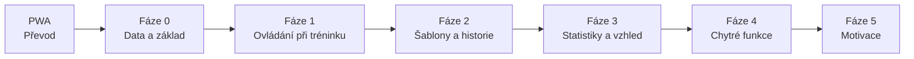

# Workout deník – plán vývoje

*Převedeno z dokumentu na claude.ai 23. 9. 2026 při přechodu na PWA + GitHub.*

## Jak s plánem pracovat

Jedna session v Claude Code = jedna úloha z plánu, označená ID (např. F1-01). Tento soubor je jediný zdroj pravdy o tom, co je hotové a co je na řadě. Hotové úlohy jsou tu jen jedním řádkem, celé popisy a vyřešené otázky jsou v [hotovo.md](hotovo.md), log v [log.md](log.md).

1. V Claude Code otevři repo a napiš ID úlohy, např. „Udělej F0-02 z docs/plan-vyvoje.md".
2. Claude nejdřív popíše, jak bude funkce fungovat a co se změní, výhody, nevýhody a dopady na další vývoj, a položí doplňující otázky. Implementovat začne až na výslovný pokyn.
3. Claude udělá změny ve vlastní větvi a otevře pull request.
4. Otestuješ v telefonu, dáš Merge.
5. Claude v rámci téhož PR zaškrtne úlohu (zkrátí ji na jeden řádek, celý popis přesune do `hotovo.md`) a přidá řádek do `log.md`.

Pravidla pro každou úpravu:

- Jedna úloha = jedna větev = jeden pull request.
- Stará data se nesmí ztratit: nová pole mají výchozí hodnoty, uložená data se při načtení automaticky doplní.
- Před větší změnou si v appce udělat zálohu dat.
- Jen zdarma: offline, bez serveru, bez placených API a knihoven. Kód na GitHubu, hosting na GitHub Pages, data jen v telefonu.

## Kontext appky

Workout deník je osobní HTML appka (PWA) pro zápis tréninků ve fitku na Androidu, inspirovaná Hevy. Historie je importovaná z CSV exportu Hevy.

Data jsou uložená v telefonu (IndexedDB). Záloha mimo telefon řeší F0-01 (export JSON, sdílení na Disk / e-mail).

Klíčové specifikum: cvičím ve **více fitkách** a stejný stroj má v každém jiný odpor. Statistiky, grafy a předvyplňování hodnot proto musí jít oddělit podle fitka.

Původní zadání:

- Progres cviků, rozlišení warm-up a pracovních sérií, statistiky s volbou období (týden, měsíc, 3/6 měsíců, rok, vše).
- Databáze cviků s popisem nebo obrázkem, doplněná z Hevy, česko-anglické názvy.
- Šablony tréninků, vytvoření šablony z odcvičeného tréninku.
- Odpočinkový časovač se zvukem a ±15 s.
- Tělesná měření (váha, % svalů, % tuku).

## Priority a pořadí

Pořadí: nejdřív ochrana dat, pak pohodlí při samotném tréninku, pak šablony, statistiky, chytré funkce a nakonec motivace. Úlohy uvnitř fáze jsou seřazené podle priority, dělají se shora dolů.

Aktuální pořadí dalších úloh (zhodnoceno 24. 9. 2026, má přednost před pořadím ve fázích):

- Dál podle fází: zbytek fáze 1 (F1-06, F1-07), pak fáze 2, 3, 4 a 5.

```mermaid
flowchart LR
  P[PWA<br/>Převod] --> F0[Fáze 0<br/>Data a základ]
  F0 --> F1[Fáze 1<br/>Ovládání při tréninku]
  F1 --> F2[Fáze 2<br/>Šablony a historie]
  F2 --> F3[Fáze 3<br/>Statistiky a vzhled]
  F3 --> F4[Fáze 4<br/>Chytré funkce]
  F4 --> F5[Fáze 5<br/>Motivace]
```

### Převod na PWA

- [x] **PWA-01** Převod z artefaktu na PWA na GitHub Pages

### Fáze 0 – Data a základ

Bez zálohy hrozí ztráta celé historie a bez svalových partií u cviků nejdou udělat statistiky ve fázi 3.

- [x] **F0-01** Záloha jedním klepnutím (export a import JSON, body obnovy, připomínka)
- [x] **F0-02** Databáze cviků se svalovými partiemi
- [x] **F0-03** Přidání cviku z online databáze free-exercise-db
- [x] **F0-04** Verze appky v Nastavení, testovací verze PR
- [x] **F0-05** Záložka Cviky
- [x] **F0-06** Systémové tlačítko Zpět
- [x] **F0-07** Pořadí fitek, uložená barva fitka
- [x] **F0-08** Pravidla zabezpečení (Content-Security-Policy)
- [x] **F0-09** Odkaz u cviku jen http(s)
- [x] **F0-10** Čitelný kód (přeformátování)
- [ ] **F0-11** Rozdělit `js/app.js` do víc souborů podle částí (např. datová vrstva a záloha, rozdělaný trénink a pauza, historie s kalendářem a souhrnem, statistiky, záložka Cviky, nastavení; v `app.js` zůstane start, vykreslení a akce). Bez build kroku: víc `<script>` v `index.html` ve správném pořadí a všechny soubory do `FILES` v `sw.js`. **Odloženo 27. 9. 2026 (u F0-12):** přínos pro spotřebu tokenů je po F0-12 střední (sekce mají popis a ID v nadpisu, čte se jen potřebná část), riziko je jisté (dnes je vše v jedné funkci, po rozdělení by jména sdílely všechny soubory a mohla by se srazit s vestavěnými jmény prohlížeče; přerušená historie řádků; obrovské konflikty s otevřenými PR). Vrátit se, až `app.js` naroste nad cca 18 000 řádků nebo se v něm začnou často přetahovat souběžné větve. Dělat jen bez otevřených PR.
- [x] **F0-12** Úklid repa pro menší spotřebu tokenů (kratší `CLAUDE.md`, rozdělený plán, `.ignore`, smazaná `puvodni/`)

### Fáze 1 – Ovládání při tréninku

Největší přínos při každém tréninku, většinou malé úpravy.

- [x] **F1-01** „Minule“ u každé série, předvyplnění
- [x] **F1-02** Displej nezhasne během pauzy (Wake Lock)
- [x] **F1-03** Krokovač +/− pro váhu a opakování
- [x] **F1-04** Časovač pauzy z času konce, vibrace, oznámení
- [x] **F1-05** Pokračování rozdělaného tréninku po zavření prohlížeče
- [ ] **F1-06** Přidávání cviku: naposledy cvičené nahoře, sekce „cvičil jsi v tomto fitku", hledání bez diakritiky v CZ i EN názvu (hledání bez diakritiky hotové už v F0-05).
- [ ] **F1-07** Poznámky ke stroji podle fitka (nastavení sedačky, opěrky).
- [x] **F1-08** Zahřívací série „60 %“ z minula
- [ ] **F1-09** Délka pauzy podle cviku (jako v Hevy, např. dřep 3 min, biceps 1 min), jinak výchozí časovač z Nastavení. Zatím odloženo, rozhodnout později (vzniklo u F1-04). Po kole pracovních sérií supersérie má přednost Časovač po pracovní supersérii (rozhodnuto u F4-05), délka pauzy se vybírá v `toggleSetDone` přes `ssRest`.
- [x] **F1-10** Kontrola čísel, upozornění na velký skok
- [ ] **F1-12** Ruční spuštění pauzy (nápad, rozhodnout později; vzniklo u F4-05): s vypnutým časovačem pauzy (hlavní vypínač v Nastavení → Odpočinek) jít pauzu spustit ručně, např. klepnutím na čas tréninku nahoře.
- [x] **F1-11** Opravy z používání při tréninku (návrat na naposledy změněný cvik…)

### Fáze 2 – Šablony a historie

- [x] **F2-01** Cvičit znovu z historie
- [x] **F2-02** Šablony podle fitka
- [x] **F2-03** Smazání série tahem, Vrátit cvik
- [ ] **F2-04** Rotace programu: appka ukáže, která šablona je na řadě.
- [x] **F2-05** Vlastní fotky u cviku
- [x] **F2-08** Jedinečné názvy šablon
- [ ] **F2-06** Archivace starých fitek a tréninků (vzniklo u F3-01, rozhodnout později): fitko, kam už se nechodí, zmizí z výběru a filtrů, tréninky a statistiky zůstanou.
- [x] **F2-09** Úvodní obrazovka během tréninku
- [x] **F2-07** Pořadí přetažením prstu

### Fáze 3 – Statistiky a vzhled

Předpoklad: F0-02 (svalové partie).

- [x] **F3-01** Barvy fitek a partií, tmavý režim
- [x] **F3-02** Osobní rekordy s oslavou
- [x] **F3-03** Souhrn po tréninku
- [ ] **F3-04** Radar svalových partií ve statistikách: aktuální vs předchozí období, filtr fitka, karty s rozdíly (tréninky, čas, objem, série), klepnutí na osu ukáže cviky.
- [ ] **F3-05** Radar v souhrnu po tréninku: volitelné, přepínatelné doplnění ke schématu postavy (F3-03), ne jeho náhrada.
- [x] **F3-06** Kalendář
- [ ] **F3-07** Roční heatmapa tréninků (barva podle počtu sérií). **Odloženo 24. 9. 2026:** po náhledech samoúčelná, co a kdy se cvičilo ukazuje kalendář (F3-06) a graf Průběh. Celá diskuse, rozhodnutí, náhledy a odkaz na hotový kód v `docs/navrhy/F3-07-heatmapa.md`.
- [x] **F3-08** Jednotky v grafech
- [x] **F3-09** Nastavení jako rozcestník
- [x] **F3-10** Oprava: Statistiky cviku na čas a vzdálenost
- [x] **F3-11** Jednotná stupnice písma, volba Velikost písma
- [x] **F3-12** Tlačítko Dokončit v souhrnu
- [x] **F3-13** Statistiky rozdělené na části
- [x] **F3-14** Nový / Upravit cvik jako stránka
- [ ] **F3-15** Zajímavosti ve Statistikách (nápad 25. 9. 2026, nic nerozhodnuto): kromě grafů a porovnání vtipné nebo unikátní údaje z vlastních dat. Rekordní dny (největší objem, nejdelší trénink, nejvíc sérií, nejintenzivnější trénink v kg/min; klepnutí otevře souhrn tréninku), zvyky (ranní ptáče / noční sova, oblíbený den v týdnu, nejdelší mezera bez tréninku, index vynechaných nohou, sváteční trénink), kuriozity (nejdelší pauza mezi sériemi, nejčastější počet opakování) a obrazná srovnání (F5-07). Vše se počítá z uložených tréninků, nic se neukládá. Návrh: čtvrtá část „Zajímavosti“ ve Statistikách (F3-13), platí filtr fitka a období. Celý seznam nápadů, souvislosti a otevřené otázky v `docs/navrhy/F3-15-zajimavosti.md`.
- [ ] **F3-16** Rozepsaný formulář přežije zavření appky (vzniklo u F3-14): když při psaní Nového / Upravit cvik přepnu do jiné appky (např. YouTube nebo Hevy kvůli odkazu) a Android appku mezitím zavře, rozepsaný cvik se ztratí. Rozepsané hodnoty průběžně ukládat (`Local`) a po restartu stránku otevřít znovu. Rozhodnout, kam pak vede Zpět a Uložit (panel výběru cviků po restartu neexistuje) a jestli totéž udělat i pro úpravu uloženého tréninku a šablony (dnes se po restartu také ztratí; rozdělaný trénink se ukládá už teď).
- [x] **F3-17** Jedinečné názvy cviků
- [x] **F3-18** Výběr cviků stejný jako záložka Cviky
- [x] **F3-19** Uložený trénink jako stránka
- [x] **F3-20** Vlastní ikony místo emoji
- [x] **F3-21** Kratší nápovědy (otazník v nadpisu sekce)
- [x] **F3-22** Karta cviku bez štítků

### Fáze 4 – Chytré funkce

- [x] **F4-01** Návrh progrese (double progression)
- [ ] **F4-02** Generátor rozcvičkových sérií z pracovní váhy.
- [ ] **F4-03** Kalkulačka kotoučů na osu.
- [ ] **F4-04** RIR/RPE u série (volitelné).
- [x] **F4-05** Supersérie se společnou pauzou
- [x] **F4-06** Upozornění na stagnaci
- [ ] **F4-07** Plánované tréninky v kalendáři.
- [x] **F4-08** Sdílení souhrnu tréninku jako obrázek
- [ ] **F4-09** Export do CSV pro Excel.
- [ ] **F4-10** Anglická verze appky (přání 25. 9. 2026 u F4-08, nic nerozhodnuto): přepínač jazyka Čeština / English v Nastavení → Vzhled, všechny texty appky přeložené. Cviky z databáze už mají anglický název (`name`) i český (`cz`), obrázek souhrnu (F4-08) už anglicky umí (texty `SHR_TXT` v `js/app.js`). Rozhodnout: jak texty v kódu oddělit (jeden slovník pro celou appku), formát data a čísel (82.5 / 82,5), co s popisy cviků (jen česky?) a s vlastními názvy (tréninky, šablony, fitka se nepřekládají).
- [ ] **F4-11** Vylepšit panel Sdílet trénink (přání 25. 9. 2026 u F4-08: rozvržení je v první verzi „stačí, ale nejsem moc spokojený“). Dnes: panel přes skoro celou výšku, náhled vyplní místo nahoře, pod ním tři řádky ovládání (Příspěvek | Příběh; Tmavý | Světlý a CZ | EN; fotka a přepínací tlačítko Postava) a patička Uložit obrázek | Sdílet, bez nápovědy (`sheetShare` v `js/app.js`). Při písmu „Největší“ se „Změnit fotku“ zalomí na 2 řádky. Nejdřív udělat náhledy víc variant (např. volby jako ikony nebo menší štítky, náhled přes celou šířku, volby v rozbalovací liště) a vybrat s uživatelem.

### Fáze 5 – Motivace

Předpoklad: F3-02 (oslava rekordu). Vše se počítá z uložených tréninků, nic nového se neukládá (kromě nastavení). Každá funkce jde vypnout, volby patří do skupiny Nastavení → Rekordy a pokrok (přejmenovaná z „Rekordy“ v F4-06). Žádná oznámení na pozadí a žádné výčitky („ztratíš streak“).

- [ ] **F5-01** Kolik chybí na rekord: u série v rozdělaném tréninku drobná nápověda, co je potřeba na nový rekord (např. „[medaile] 8 opak. = nový 1RM“, „85 kg = max. zátěž“). Navazuje na F4-01.
- [ ] **F5-02** Týdenní cíl: v Nastavení počet tréninků za týden (např. 3), na obrazovce Trénink kolečko „2 / 3 tento týden“, streak počítá týdny se splněným cílem (dnes `calStreak` = týdny aspoň s 1 tréninkem).
- [ ] **F5-03** Milníky (odznaky): 10./50./100. trénink, N týdnů v řadě, celkem zvednuto 10/100 t, první trénink v novém fitku… Při dosažení oslava jako u rekordu (odznak místo medaile), ve Statistikách nástěnka se získanými i zamčenými odznaky.
- [ ] **F5-04** Pokrok v čase: karta „Před rokem jsi na bench dal 60 kg, dnes 85 kg (+42 %)“ u nejčastějších cviků (Statistiky, případně stránka cviku).
- [ ] **F5-05** Měsíční shrnutí: na začátku měsíce karta za minulý měsíc (tréninky, rekordy, nejlepší cvik, porovnání s předchozím měsícem), na konci roku „Rok v posilovně“.
- [ ] **F5-06** Kluby síly: odznaky „Klub 100 kg bench“, „bench = tělesná hmotnost“ apod. (tělesnou hmotnost appka zná).
- [ ] **F5-07** Objem obrazně: „Tento měsíc jsi zvedl 42 t, to jsou 3 autobusy.“
- [ ] **F5-08** Osobní výzvy: appka navrhne výzvu podle průměru (např. „12 tréninků v říjnu“, „+10 % objemu nohou“), průběh na obrazovce Trénink.
- [ ] **F5-09** Zanedbaná partie: nenápadná informace na obrazovce Trénink („Nohy naposledy před 10 dny“), jen v appce, bez oznámení. Navazuje na skupiny partií (F3-01) a radar (F3-04).

## Co neděláme

| Nápad | Proč ne |
|---|---|
| Spálené kalorie při tréninku | Odhad přes MET má u posilování chybu ±30–50 %, bez tepu nemá vypovídací hodnotu a svádí k „dojídání". Náhrada: trend tělesné váhy. |
| Sledování jídla a příjmu kalorií | Samostatná velká aplikace, na to existují specializované appky. |
| Napojení na hodinky / Health Connect | Z webové appky nedostupné, jen z nativní aplikace. |
| Cloud, server, synchronizace dat | Jen offline a zdarma, data zůstávají v telefonu, zálohu řeší F0-01. (GitHub slouží jen pro kód a hosting.) |
| XP body a levely | Působí uměle a neříkají nic o skutečném pokroku; motivaci řeší rekordy, milníky a týdenní cíl (fáze 5). |

Odloženo (vrátit se, až bude fáze 3 hotová):

- Automatická volba fitka podle GPS: ruční volba stačí, GPS vyžaduje oprávnění a baterii.
- Silueta postavy obarvená podle zatížení ve Statistikách: radar (F3-04) pokryje totéž jednodušeji. (V souhrnu po tréninku je postava od F3-03.)
- Jemnější dělení partií (biceps/triceps, kvadricepsy/hamstringy/hýždě): podle odpovědi na otevřenou otázku.

## Otevřené otázky

Rozhodnout nejpozději v session dané úlohy. U každé je návrh výchozí volby.

| Úloha | Otázka | Návrh |
|---|---|---|
| F0-11 | Podle čeho dělit soubory a jak si budou předávat data (dnes je vše v jedné funkci)? | Podle záložek a datové vrstvy; společný stav přes jeden sdílený objekt (např. `window.WD`), pořadí skriptů pevně v `index.html`. |
| F3-07 | Heatmapa: rozložení, období, podle čeho barvit, umístění? | Odloženo 24. 9. (samoúčelná, málo informací navíc proti kalendáři a grafu Průběh). Dohodnuté: 12 měsíců 3 × 4, posledních 12 měsíců se šipkami a swipem, přepínač Série / Objem / Čas / Opakování (výchozí Objem, legenda v tunách), nezávislá na volbě období. Podrobně v `docs/navrhy/F3-07-heatmapa.md`. |
| F3-04 | Osy radaru podle sérií, nebo přepínač série ↔ objem? | Pracovní série, sekundární partie × 0,5 |
| F3-04 | 6 hlavních partií, nebo jemnější dělení? | 6 partií |
| F5-02 | Počítat do týdenního cíle všechna fitka? Co když cíl změním v průběhu? | Všechna fitka; změna cíle platí od aktuálního týdne, starší týdny se hodnotí podle cíle, který tehdy platil (nebo zjednodušeně podle aktuálního). |
| F5-03 | Které milníky a kolik jich? Ukazovat zamčené odznaky? | Začít s 10–15 odznaky; zamčené ukazovat šedě i s tím, kolik zbývá. |
| F5-09 | Po kolika dnech je partie „zanedbaná“? | 7 dní u hlavních skupin, jde vypnout. |
